# Débricker l'arduino Nano ESP32

## Introduction
Si cela vous arrive comme moi : un transfert de programme qui bloque votre Arduino (impossible de la reprogrammer), le programme reboot en boucle (le port COM apparaît et disparaît sans arrêt), le mode safe (double tape sur RST) ne fonctionne plus.

Alors il est possible que vous ayez un firmware corrompu.

Dans ce cas, ma solution, trouvée après plusieurs heures de recherche, est la reprogrammation complète de l'EEPROM.

En effet, l'Arduino Nano ESP32 est composé de plusieurs programmes en mémoire :

| Composant        | Offset (Adresse) | Rôle                                                  |
| ---------------- | ---------------- | ----------------------------------------------------- |
| Bootloader       | 0x0              | Initialise le CPU et cherche la table des partitions. |
| Partition Table  | 0x8000           | Le "plan" de la mémoire flash (8KB).                  |
| Firmware (Blink) | 0x10000          | Votre code utilisateur (l'application principale).    |
| Nora Recovery    | 0xF70000         | Le mode de secours (Double-Tap RST / LED Verte).      |

La technique ici est de réécrire l'ensemble de ces programmes pour réinitialiser l'Arduino et ainsi retrouver une carte totalement fonctionnelle.

## Erreurs rencontrées

Voici quelques exemples de problèmes que vous pouvez rencontrer.

**Avec esptool impossible de communiquer**

```shell
python -m esptool --port COM5 chip_id
Warning: Deprecated: Command 'chip_id' is deprecated. Use 'chip-id' instead.
esptool v5.2.0
Serial port COM5:
Connecting......................................

A fatal error occurred: Failed to connect to Espressif device: Invalid head of packet (0x08): Possible serial noise or corruption.
For troubleshooting steps visit: https://docs.espressif.com/projects/esptool/en/latest/troubleshooting.html
```

**Le gestionnaire de périphériques s'actualise sans fin et détecte sans arrêt le port COM puis le perd.**

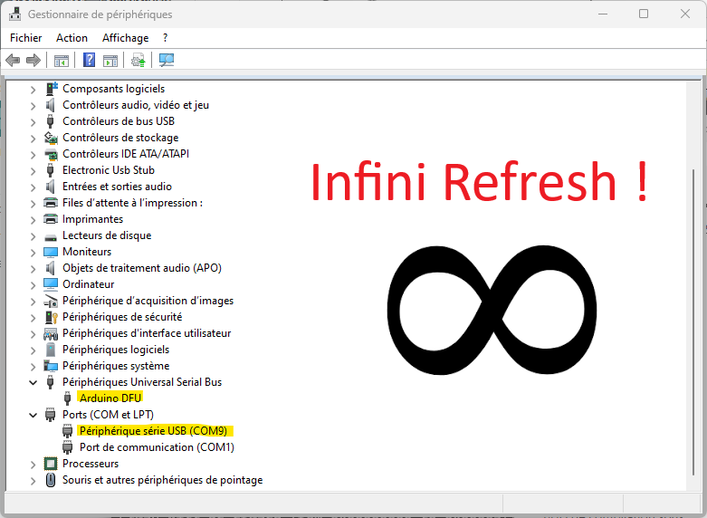

****

## Prérequis

**ARDUINO IDE**

https://www.arduino.cc/en/software/

**ESPTOOL**

Installer dans l'environnement Python.

```shell
pip install esptool
```

Vous permez d'utiliser :

```shell
python -m esptool ...
```

## Reprogrammation complète
Ouvrir **Arduino-IDE** et sélectionner le bon modèle de carte, ici **Arduino Nano ESP32**

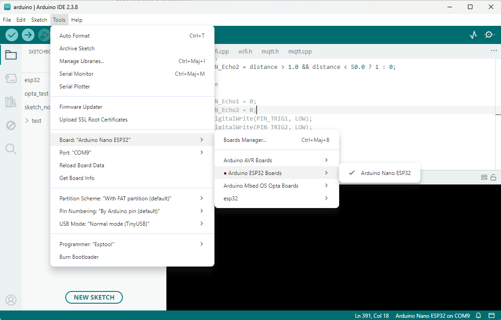

Ouvrir le Sketch **Basics > Blink**

Celui-ci va nous permettre de récupérer un programme saint ainsi que les programmes de boot et partition.

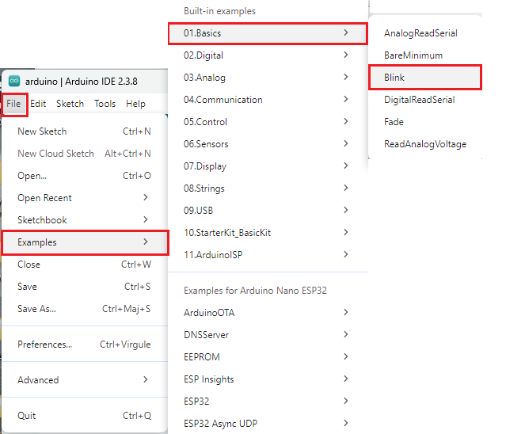


**Compiler** le **Sketch**

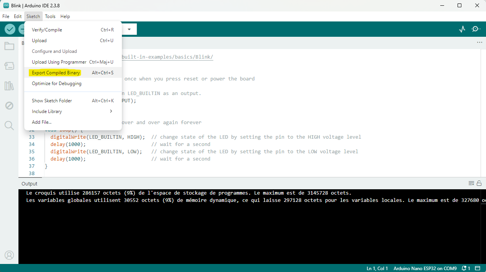

Ouvrir le dossier du **Sketch**

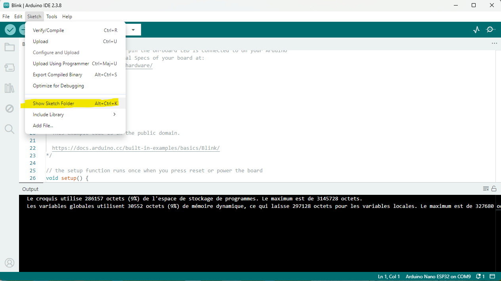

Ouvrir le dossier du **build**

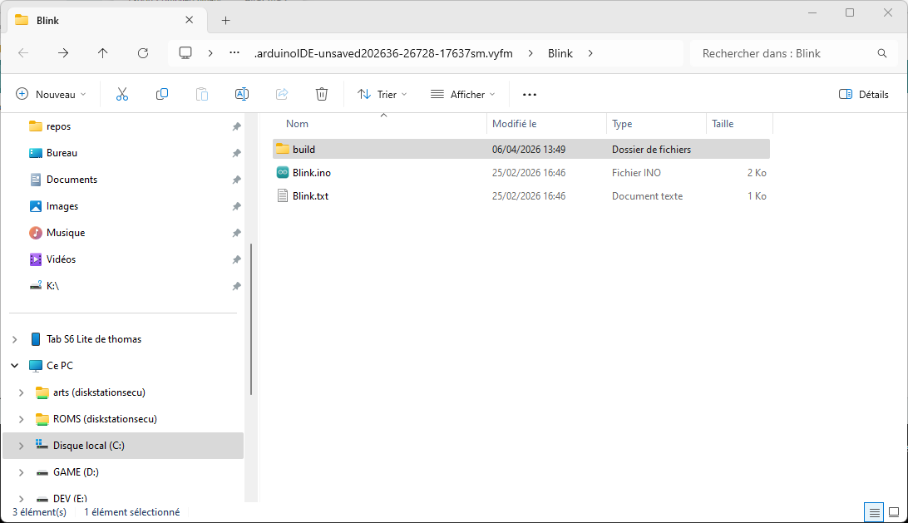

Naviguer jusqu'à l'**image binaire** du **Sketch**

Ici nous avons une version compilé du loader, partition et programme créé par le compilateur pour notre board.

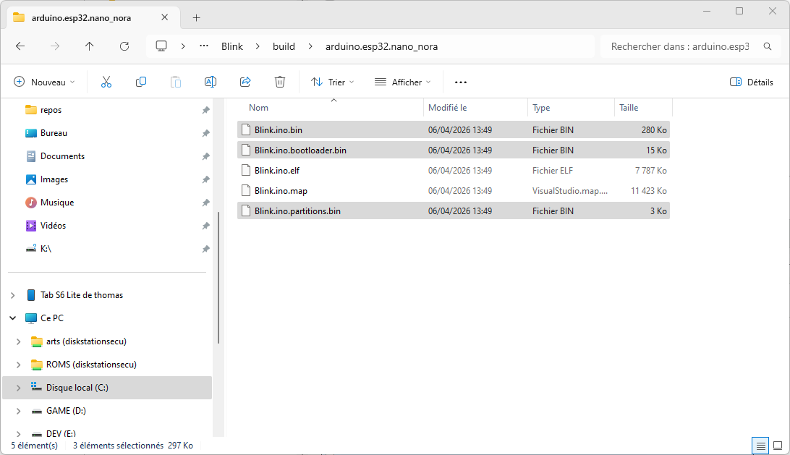

Ouvrir le dossier contenant l'image du **Recovery** pour votre Arduino

```
"%AppData%\Local\Arduino15\packages\arduino\hardware\esp32\2.0.18-arduino.5\variants\arduino_nano_nora\extra\nora_recovery"
```

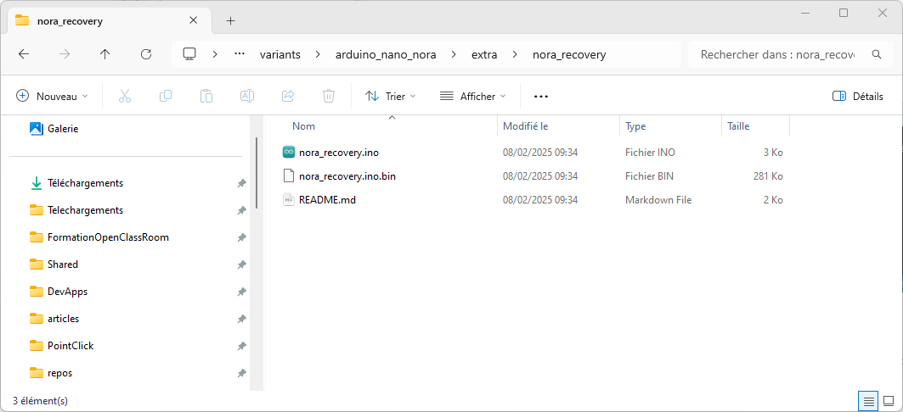

Copier les fichiers du **programme**, du **bootloader** et des **partitions** dans le dossier contenant l'image du **Recovery** pour votre Arduino.

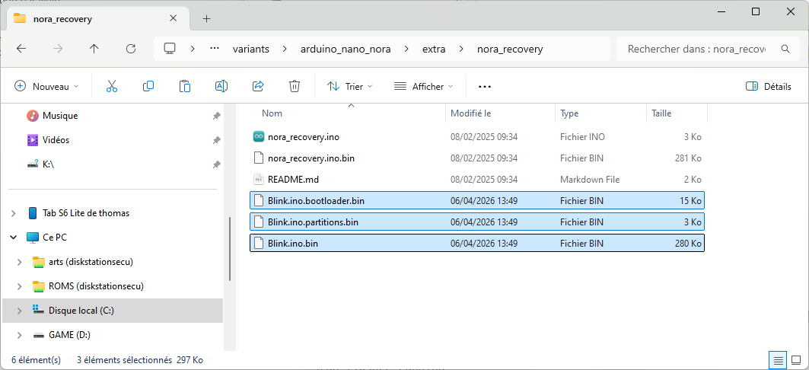

Vérifier l'adresse du programme dans le fichier **Readme (ici: 0xF70000)**

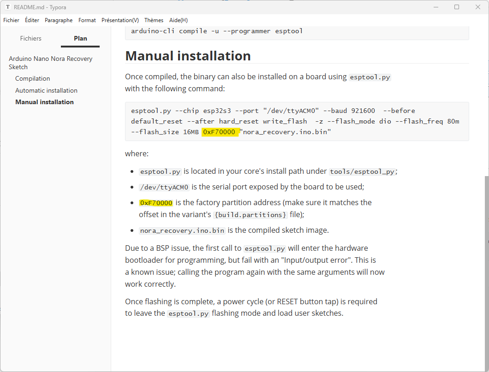

Placer l'Arduino en **mode "ROM Bootloader"**

- Munissez-vous d'un petit fil de pontage (jumper wire).
- Reliez la broche **B1** à la broche **GND** (masse).
- Branchez la carte à votre ordinateur (ou appuyez sur Reset si elle est déjà branchée).
- La LED passe au vert et le port COM apparaît de nouveau dans le gestionnaire de périphériques (et reste stable).

On est maintenant prêt à reprogrammer l'Arduino !

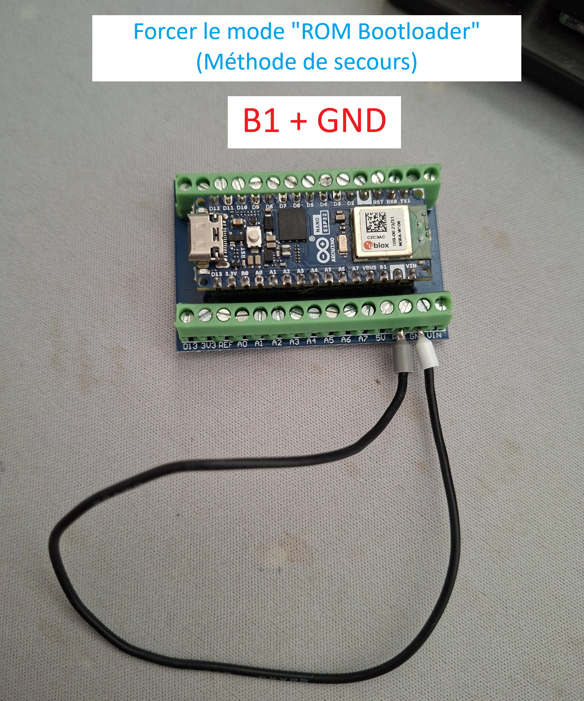

Ouvrir la console **Python** (ici **Anaconda Prompt**) dans le dossier du **recovery**.

Téléchargez puis décompressez l'archive téléchargée précédemment dans le répertoire de votre choix. Je vous conseille de l'embarquer avec votre projet.

```shell
python -m esptool --chip esp32s3 --port COM8 --baud 921600 write-flash 0x0 Blink.ino.bootloader.bin 0x8000 Blink.ino.partitions.bin 0x10000 Blink.ino.bin 0xF70000 nora_recovery.ino.bin
```

Attention : adaptez le **port COM `[--port]`** et le **type de puce `[--chip]`** en fonction de votre environnement.

Vous devriez avoir un résultat comme ceci :

```shell
esptool v5.2.0
Connected to ESP32-S3 on COM8:
Chip type:          ESP32-S3 (QFN56) (revision v0.1)
Features:           Wi-Fi, BT 5 (LE), Dual Core + LP Core, 240MHz, Embedded PSRAM 8MB (AP_3v3)
Crystal frequency:  40MHz
USB mode:           USB-Serial/JTAG
MAC:                34:85:18:7b:7f:2c

Stub flasher running.
Changing baud rate to 921600...
Changed.

Configuring flash size...
Flash will be erased from 0x00000000 to 0x00003fff...
Wrote 15104 bytes (10429 compressed) at 0x00000000 in 0.3 seconds (445.9 kbit/s).
Hash of data verified.
Flash will be erased from 0x00008000 to 0x00008fff...
Wrote 3072 bytes (158 compressed) at 0x00008000 in 0.1 seconds (229.7 kbit/s).
Hash of data verified.
Flash will be erased from 0x00010000 to 0x0004dfff...
Wrote 252976 bytes (139747 compressed) at 0x00010000 in 2.1 seconds (941.8 kbit/s).
Hash of data verified.
Flash will be erased from 0x00f70000 to 0x00fb6fff...
Wrote 287120 bytes (164326 compressed) at 0x00f70000 in 2.3 seconds (1002.2 kbit/s).
Hash of data verified.

Hard resetting via RTS pin...
```

Si vous ne reprogrammez pas toute la mémoire, vous pouvez par exemple avoir un programme qui démarre mais le **double-tap ne fonctionne pas**, car le **recovery** n'est pas fonctionnel, ou inversement.

Normalement vous devez récupérer un Arduino fonctionnel avec un programme (LED orange qui clignote) et le mode safe (double-tap) qui fonctionne également. Maintenant vous pouvez de nouveau téléverser votre programme.

--------------------------

Auteur: [Thomas AUGUEY](https://github.com/Ace4teaM)

Tags: #arduino #programmation