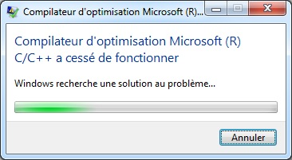
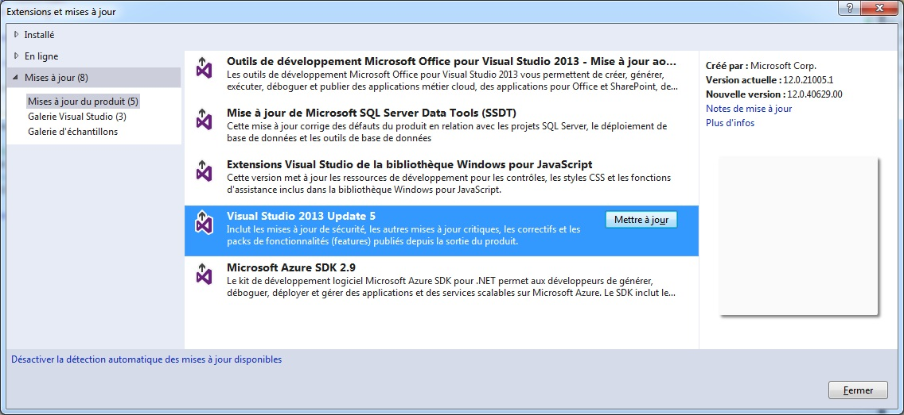
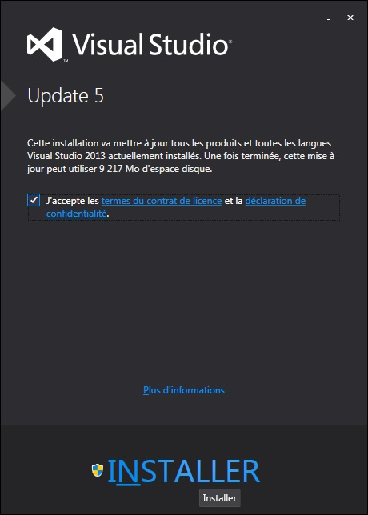

# La librairie BOOST pour les applications C++

## Introduction
Boost est un ensemble librairies C++ utilisées pour optimiser et faciliter le développement de vos applications.

Boost propose un grand nombre de fonctionnalités tel que la gestion de la mémoire, la programmation paralèlle et mêmes quelques extensions du langage comme les boucles `ForEach`.

En plus d'être stable et performante, boost est distribué sous **licence GPL**, vous pouvez donc l'utiliser dans un projet commercial.

Vous l'aurez compris Boost est une très bonne base pour débuter un projet C++.

## Prérequis
Pour fonctionner, votre application doit être liée aux librairies boost qui vous interesse.

Voici la liste officiel de ces librairies: [http://theboostcpplibraries.com/](http://theboostcpplibraries.com/ "Boost Library")

Boost est distribué sous forme de code source téléchargeable ici: [http://www.boost.org/users/download/](http://www.boost.org/users/download/ "Boost Download").

Le code source de boost est constitué essentiellement de templates C++ définit dans des fichiers d'en-têtes. Il n'y a donc peut de code compilable dans une librairie. Il suffit donc de lier votre projet au répertoire "include" de boost.

## Configuration avec Visual Studio
Téléchargez puis décompressez l'archive téléchargée précedemment dans le répertoire de votre choix. Je vous conseil de l'embarquer avec votre projet.

### Créer un projet et lier aux fichiers includes

* Depuis le menu `Fichier`, sélectionner `Nouveau > Projet…`
* Dans le panneau de gauche, sélectionner `Visual C++ > Win32`
* Dans le panneau de droite, sélectionner `Projet C++ Vide`
* Dans le champs `Nom` entrer `exemple`
* Clic-droit sur l'explorateur de solution puis choisissez `Propriétés`
* Dans `Propriétés de configuration > C/C++ > General > Autres répertoires Include`, ajoutez le chemin d'accès vers le répertoire racine de la librairie Boost, par exemple: `C:\boost\boost_1_62_0`
* Dans `Propriétés de configuration > C/C++ > En-têtes précompilées`, changer `Utilisation (/Yu) ` par `Sans utiliser les en-têtes précompilées`
* Remplacer le contenu du fichier `exemple.cpp` généré par l'IDE avec le code ci-dessous
* Depuis le menu `Générer`, sélectionnez `Générer la Solution`
	
#### Exemple.cpp

```c++
#include <boost/lambda/lambda.hpp>
#include <iostream>
#include <iterator>
#include <algorithm>

int main()
{
    using namespace boost::lambda;
    typedef std::istream_iterator<int> in;

    std::for_each(
        in(std::cin), in(), std::cout << (_1 * 3) << " " );
}
```

### Compiler et lier un projet aux librairies binaires

Certaines librairies font appel à des fonctions système tel que les threads par exemple.
Vous devez d'abord compiler les librairies puis les liers à votre projet.


* Rendez-vous dans le dossier racine de boost, par exemple: `C:\boost\boost_1_62_0`
* Double-Clic sur `booststrap.bat` puis attendez la fin de l'exécution. Après un moment, bootstrap.bat produit 2 fichiers: `b2.exe`, and `bjam.exe`.
* Double-Clic sur `b2.exe` puis attendre la fin de l'exécution.
* Double-Clic sur `bjam.exe` puis attendre la fin de l'exécution. Un dossier nommé `stage` est crée avec l'ensemble des librairies compilées.

Sous Visual Studio:

* Ouvrez votre projet
* Clic-droit sur l'explorateur de solution puis choisissez `Propriétés`
* Dans le panneau de gauche, sélectionner `Propriétés de configuration > C/C++ > Editeur de liens > Général`
* Sous `Répertoire de bibliothéques supplémentaires` ajouter le dossier `stage\lib` généré précédemment. par exemple: `C:\boost\boost_1_62_0\stage\lib`

## Boost et la Librairie Standard

Boost est une librairie réalisé par les auteurs de la librairie standard. Elle est un terrain d'apprentissage avant sa standardisation, il existe donc plusieurs éléments de la librairie Boost qui ont déjà été intégré à la librairie standard.

## Programmation parallèle
### Thread
La librairie thread a été standardisée, la programmation reste identique entre les 2 librairies.

**Librairie standard**

```c++
#include <thread>
#include <iostream>

using namespace std;

void my_func() {
	cout << "Hello" << endl;
}

void thread_test()
{
	// Création et lancement du thread
	std::thread my_thread(my_func);

	// Attend la fin du thread
	my_thread.join();
}
```

**Boost**

```c++
#include <boost/thread/thread.hpp>
#include <iostream>

using namespace std;

void my_func() {
	cout << "Hello" << endl;
}

void thread_test()
{
	// Création et lancement du thread
	boost::thread my_thread(my_func);

	// Attend la fin du thread
	my_thread.join();
}
```

## BUG de compilation sous Visual Studio 2013

Si vous utilisez Visual studio 2013 vous rencontrerez peut-être l'erreur suivante lors de la compilation:

	boost\type_traits\common_type.hpp(43): fatal error C1001: Une erreur interne s'est produite dans le compilateur.



Dans ce cas veuillez mettre a jour les outils de développement pour Visual Studio






--------------------------

Auteur: [Thomas AUGUEY](https://github.com/Ace4teaM)