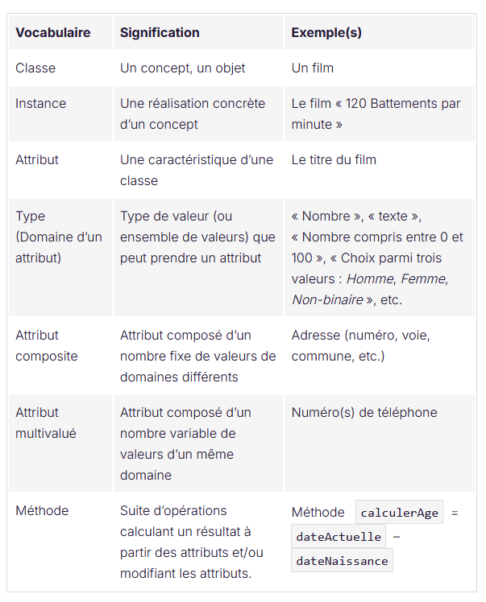
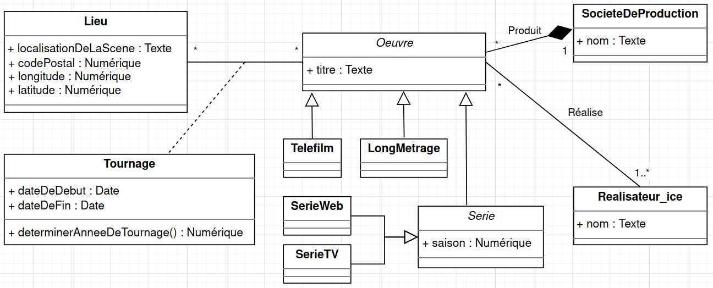
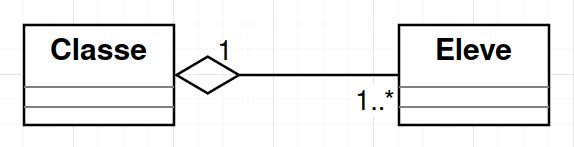
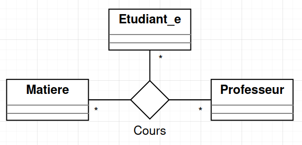
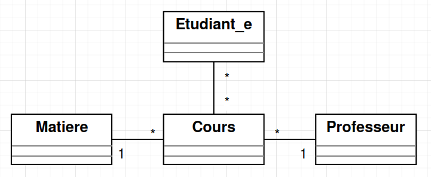
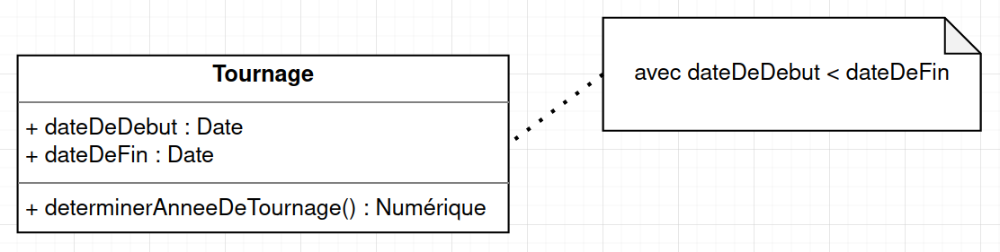
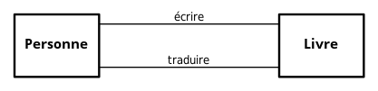
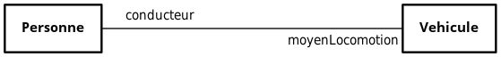
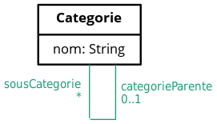

# UML - Diagrammes

## Diagramme de classes

**Types de données**

### Classe abstraites

Placer le nom de la classe en Italic permet de définir cette classe comme non instanciable. Vous devez donc définir des classes dérivées instanciable ayant comme racine votre classe abstraite.

Ici `Oeuvre` et `Serie`  sont des classes abstraites, `Telefilm`, `LongMetrage`, `SerieWeb` et `SerieTV` sont des classes dérivées 

#### L’agrégation

**L’agrégation** s’utilise lorsqu’une classe est un ensemble ou un regroupement d'objets. Elle est très similaire à une **association classique**, et que vous l'utilisiez ou non, cela n’aura aucune implication lors de la traduction du MCD vers le MLD.

Elle se représente comme ceci, avec un losange blanc (vide) :

Modélisation de l’agrégation

Contrairement à la composition, il n’y a pas de contrainte sur les multiplicités, ni  sur le cycle de vie des objets agrégés (ils peuvent exister même lorsque l’objet agrégeant disparaît).

#### L’association ternaire

Il est possible de créer des associations entre plus que 2 classes. Ce  sont les associations N-aires. Voici un exemple d’association ternaire :

Modélisation d’une association ternaire

En pratique, on n’utilise jamais d’association de degré supérieur à trois. De plus, les associations ternaires peuvent toujours être transformées  en trois associations binaires, en transformant l’association en une  nouvelle classe, comme ceci :

Création d’une classe Cours pour éviter une association ternaire

Il est conseillé **de ne pas abuser** des associations ternaires, car elles sont souvent moins intelligibles.

#### Les notes

Il est possible d’ajouter des notes au diagramme de classes. Elles servent à apporter tout type de précisions. Notamment les contraintes sur  certains attributs.

Sur votre diagramme, vous auriez pu poser la contrainte que l’attribut`dateDeDebut`doit être une date antérieure à`dateDeFin`. Eh oui, cela paraît logique, mais il faudra le spécifier à votre SGBDR car il ne le fera pas automatiquement !

Représentation d’une note à la classe Tournage

Les notes servent aussi à préciser les domaines des attributs quand ceux-ci sont plus complexes que`Entier`,`Date`,`Texte`, etc.

> Par exemple : “Entier compris entre 1 000 et 2 000”.

#### Les doubles associations

Deux classes peuvent être liées entre elles via deux (ou plus) associations.

Ce serait le cas lorsqu’une personne écrit un livre, et lorsqu’une autre personne traduit ce livre dans une autre langue :

Modélisation avec deux associations, représentée par les deux traits nommés respectivement "écrire" et "traduire"

Dans ce cas, il est nécessaire de donner un nom aux associations pour les différencier.

#### Les rôles de classes

Plutôt que de donner un nom aux associations, vous pouvez aussi caractériser  une association par le rôle que tient chacune des deux classes. C’est le cas dans cet exemple, où on peut remplacer le nom de l’association  « conduit » par « conducteur » et « moyen de locomotion » :

Modélisation avec le rôle des classes spécifié

C’est à vous de choisir si vous trouvez cette manière plus simple à  comprendre. Si vous indiquez les rôles, pas besoin d’utiliser de verbes.

#### L’association réflexive

Une classe peut être associée à elle-même !

Par exemple, une classe`Categorie`peut avoir des sous-catégories et des catégories parentes :

Représentation des sous-catégories

# UML - Outils

Il existe beaucoup de logiciels permettant de réaliser un diagramme de classes UML.

Globalement, ils se regroupent en deux catégories :

- Les outils **graphiques**, qui ne sont pas réservés à l’UML, mais qui permettent de créer facilement tous types de diagrammes.
- Les **ateliers de génie logiciel (AGL)** : ce sont des environnements de conception, souvent très puissants.  Contrairement aux outils graphiques (qui ne font que produire un  dessin), les AGL « comprennent » la modélisation UML et ils sont  capables d’interpréter votre modélisation afin de vous faciliter la  tâche : vérification du modèle, génération du code informatique  découlant du diagramme de classes, etc). Ils sont cependant plus  difficiles à prendre en main.

Parmi les outils graphiques les plus connus, on trouve *[LibreOffice Draw](https://fr.libreoffice.org/download/telecharger-libreoffice/)*, *[diagrams.net](https://www.diagrams.net/)*, *[LucidChart](https://www.lucidchart.com/pages/fr)*, etc.

En ce qui concerne les AGL, l’un des plus connus s’appelle *[ArgoUML](https://argouml.fr.uptodown.com/windows)*. Vous pouvez tester également *[Papyrus](https://www.eclipse.org/papyrus/)*, qui est un environnement de modélisation performant fonctionnant sous  Windows, MacOS et Linux. Il est gratuit, open source et développé par la fondation Eclipse.