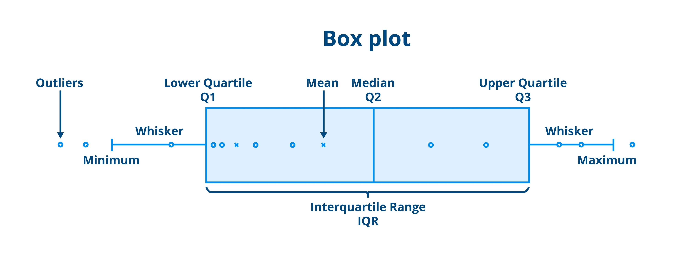

# Pandas

Pandas est une librairie Python pour manipuler des tableaux, il s'appuie sur **numpy** pour gérer des séries.

Dans **pandas**, les deux structures fondamentales sont :

- **Series**
- **DataFrame**

# Dataframe

Un **DataFrame** est **un tableau 2D (lignes + colonnes)**.

On peut le voir comme :

> **un dictionnaire de Series alignées sur le même index**

**Exemple**

```python
df = pd.DataFrame({
    "age": [25, 30, 40],
    "ville": ["Paris", "Lyon", "Nice"]
})
```

Résultat :

| index | age  | ville |
| ----- | ---- | ----- |
| 0     | 25   | Paris |
| 1     | 30   | Lyon  |
| 2     | 40   | Nice  |

Structure :

```python
        colonnes
        age   ville
index
0       25    Paris
1       30    Lyon
2       40    Nice
```

# Series

Une **Series** est **un tableau 1D (une seule colonne)** avec un index.

**Exemple**

```python
import pandas as pd

s = pd.Series([10, 20, 30])
print(s)
```

Résultat :

```python
0    10
1    20
2    30
dtype: int64
```

Structure :

```python
index → valeur
0     → 10
1     → 20
2     → 30
```

Donc une Series est composée de :

- **index**
- **valeurs**
- **dtype**

# Opérateur []

Pandas propose plusieurs opérations via l'opérateur tableau.

| contenu de `[]`     | interprétation |
| ------------------- | -------------- |
| `"col"`             | colonne        |
| `["col1","col2"]`   | colonnes       |
| `[True, False,...]` | filtre lignes  |


`df["colonne"]` → retourne une **Series**

Quand on passe **un seul nom de colonne (string)**.


`df[["colonne"]]` → retourne un **DataFrame**

Quand on passe **une liste de colonnes**.

Certaines opérations **attendent un DataFrame** et pas une Series, ex: `df[["age"]].mean()`


`df[condition]` → filtrage lignes

Quand on passe **une expression**

exemple: `df[df["age"] > 30]` 

retourne **une Series de booléens** (`True` / `False`) indiquant **pour chaque ligne si la condition est vraie**.

exemple: `[False, False, True, True]`

`df[masque]`

garde seulement les lignes `True`.

```python
df["age"]          -> [25, 30, 40, 50]
df["age"] > 30     -> [F,  F,  T,  T]
df[mask]           -> garde lignes T
```

On peut combiner plusieurs masques avec ET (`&`) ou OU (`|`)

```python
df[(df["age"] > 30) & (df["age"] < 50)]
```

Ainsi les 2 masques booléens seront combiné en 1

# Import

```
import pandas as pd
```

# describle()

Lorsque vous l'utilisez sur des colonnes numériques (entiers ou flottants), pandas retourne les indicateurs suivants :

- **count** : Le nombre de valeurs non manquantes (non-NaN).
- **mean** : La moyenne arithmétique.
- **std** : L'écart-type (mesure la dispersion par rapport à la moyenne).
- **min** : La valeur minimale.
- **25%** : Le premier quartile (25 % des données sont inférieures à cette valeur).
- **50%** : La médiane (50 % des données sont inférieures à cette valeur).
- **75%** : Le troisième quartile (75 % des données sont inférieures à cette valeur).
- **max** : La valeur maximale.



**Calculer le premier quartile (Q1)**

Pour calculer le premier quartile (Q1) avec pandas (qui utilise par défaut l'interpolation linéaire), il faut suivre une méthodologie précise. Prenons votre série de données : [4,8,4,12,1,8,6].

Voici les étapes pas à pas :

1. **Trier les données par ordre croissant**

C'est l'étape indispensable. Sans tri, les calculs de position n'ont aucun sens.

- Données brutes : [4,8,4,12,1,8,6]
- **Données triées** : [1,4,4,6,8,8,12]
- Nombre d'observations (n) : 7

2. **Calculer l'indice (la position)**

La formule standard utilisée par la plupart des logiciels (dont pandas/NumPy) pour trouver la position i du quartile est :

i=(n−1)×0.25

Dans votre cas :

i=(7−1)×0.25=6×0.25=1.5

3. **Interpoler la valeur**

L'indice trouvé (1.5) n'est pas un nombre entier. Cela signifie que le quartile Q1 se situe entre la valeur à l'index **1** et la valeur à l'index **2** (en commençant à compter à 0).

- Valeur à l'index 1 : **4**
- Valeur à l'index 2 : **4**

Puisque les deux valeurs entourant la position 1.5 sont identiques, le résultat est immédiat : **Q1=4**.

------

**Si les valeurs avaient été différentes (Le calcul d'interpolation)**

Si votre série avait été différente et que vous aviez dû trancher entre deux nombres, par exemple entre **4** (index 1) et **6** (index 2) à la position **1.5**, le calcul de pandas serait :

Valeur basse+(Reste deˊcimal×(Valeur haute−Valeur basse))

4+0.5×(6−4)=5

**Résumé pour votre liste**

| Statistique                 | Valeur         |
| --------------------------- | -------------- |
| **Série triée**             | 1,4,4,6,8,8,12 |
| **Médiane (Q2)**            | 6              |
| **Premier Quartile (Q1)**   | **4**          |
| **Troisième Quartile (Q3)** | 8              |

# Explications rapides :

1. **`pd.DataFrame({...})`** → créer un tableau
2. **`.head()`** → voir les premières lignes
3. **`df["col"]`** → sélectionner une colonne (Series)
4. **`df[["col1","col2"]]`** → sélectionner plusieurs colonnes
5. **`df[condition]`** → filtrer les lignes
6. **`df["new_col"] = ...`** → ajouter une colonne calculée
7. **`groupby("col")["col2"].sum()`** → agrégation par groupe
8. **`sort_values("col")`** → trier
9. **`fillna()`** → gérer les valeurs manquantes
10. **`describe()`** → résumé statistique rapide


## Créer un DataFrame
```python
df = pd.DataFrame({"ville": ["PARIS","LYON","MARSEILLE"], "benefices": [100, 80, 50], "revenu": [1000, 900, 700]})
```


## Voir les premières lignes
```python
print(df.head())
```


## Sélectionner une colonne
```python
print(df["ville"])
```


## Sélectionner plusieurs colonnes
```python
print(df[["ville", "revenu"]])
```


## Filtrer des lignes
```python
print(df[df["revenu"] > 800])
```


## Ajouter une nouvelle colonne
```python
df["ratio"] = df["benefices"] / df["revenu"]
```


## Agréger des données (somme par ville)
```python
print(df.groupby("ville")["benefices"].sum())
```


## Trier les données
```python
print(df.sort_values("revenu", ascending=False))
```


## Remplacer les valeurs manquantes
```python
df["benefices"].fillna(0, inplace=True)
```


## Résumé statistique
```python
print(df.describe())
```

