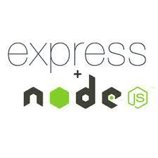

## API

API est une abbréviation et signifie ***Application Programming Interface*** (ou ***interface de programmation d’application***, en français). Pour faire simple : c’est un moyen de communication entre deux logiciels, que ce soit entre différents composants d’une  application ou entre deux applications différentes.

**API = Application Programming Interface**

C’est **un contrat** qui définit **comment deux systèmes communiquent**.

- Peut être **locale** (librairie C#, API Java, SDK…)
- Peut être **réseau** (HTTP, WebSocket, gRPC…)
- Peut utiliser **n’importe quel protocole** (HTTP, TCP, fichiers, etc.)
- Pas forcément du web

Exemples :

- L’API Unity
- L’API .NET
- Une API SOAP
- Une API HTTP maison

**API = le concept global**

## API REST

REST signifie ***Re****presentational* ***S****tate* ***T****ransfer* (ou *transfert d’état de représentation*, en français), et constitue un ensemble de **normes**, ou de lignes directrices **architecturales** qui structurent la façon de communiquer les données entre votre  application et le reste du monde, ou entre différents composants de  votre application.

**REST = Representational State Transfer**
 C’est **un style d’architecture**, pas une techno.

Une **API REST** est donc :

> Une API web qui respecte les principes REST

Principes clés :

- Utilise **HTTP**
- Manipule des **ressources** (users, orders, products…)
- Utilise les **verbes HTTP** correctement :
  - `GET` → lire
  - `POST` → créer
  - `PUT/PATCH` → modifier
  - `DELETE` → supprimer
- **Stateless** (pas d’état serveur)
- Réponses souvent en **JSON**

**API REST = API web suivant les règles REST**

## API RESTful

Nous utilisons l’adjectif RESTful pour décrire les API REST. Toutes les API  REST sont un type d’API – mais toutes les API ne sont pas RESTful  !

Les API RESTful se basent sur le protocole **HTTP** pour transférer les informations – le même protocole sur lequel la communication web est fondée  ! Donc, lorsque vous voyez **http** au début d’une URL, comme [**http**://twitter.com](https://twitter.com/) – votre navigateur utilise HTTP pour faire une requête de ce site web au serveur. REST fonctionne de la même façon  !

**RESTful** signifie :

> *« conforme aux principes REST »*

En pratique :

- **Toutes les API REST ne sont pas totalement RESTful**
- RESTful insiste sur le **respect strict** des contraintes REST

Différences subtiles mais importantes :

| REST                | RESTful                   |
| ------------------- | ------------------------- |
| Utilise HTTP        | Utilise HTTP              |
| Ressources + verbes | Ressources + verbes       |
| Peut tricher un peu | Respect strict des règles |
| Souvent pragmatique | Plus académique           |

Exemple **pas vraiment RESTful**  :

```http
POST /getUser
POST /deleteOrder
```

Exemple **RESTful** :

```http
GET /users/42
DELETE /orders/10
```

Autres points RESTful avancés :

- Codes HTTP corrects (`200`, `201`, `404`, `409`, `401`…)
- HATEOAS (liens dans les réponses, rarement utilisé en vrai)
- Pas de verbes dans l’URL

**RESTful = REST bien fait**

------

## API RESTful Cache

Le cache est un très bon moyen d'optimiser les échanges client/serveur.

**Principe clé : tout n’est pas cacheable**

En REST, **seules les requêtes de lecture** sont cacheables par défaut.

| Méthode HTTP  | Cache ? | Pourquoi       |
| ------------- | ------- | -------------- |
| `GET`         | OUI     | Lecture pure   |
| `HEAD`        | OUI     | Métadonnées    |
| `POST`        | NON     | Modifie l’état |
| `PUT / PATCH` | NON     | Modifie        |
| `DELETE`      | NON     | Modifie        |

**Règle d’or** :

> *Si la requête ne change pas l’état serveur → elle peut être cacheable.*

### **Cache client (navigateur)**

Le plus simple et le plus puissant : **les headers HTTP**.

#### a) Cache-Control (le plus important)

```
Cache-Control: public, max-age=300
```

Ici :

- `public` : cache navigateur + proxy
- `max-age=300` : 5 minutes

Exemples utiles :

```
Cache-Control: no-store
Cache-Control: no-cache
Cache-Control: private, max-age=60
```

Cas typiques :

- Données publiques → `public`
- Données utilisateur → `private`
- Données ultra-sensibles → `no-store`

#### b) ETag (cache intelligent)

Le **meilleur compromis** pour les APIs dynamiques.

Réponse serveur

```
ETag: "a1b2c3"
```

Requête suivante du client

```
If-None-Match: "a1b2c3"
```

Réponse serveur si inchangé

```
304 Not Modified
```

Résultat :

- Pas de JSON renvoyé
- Gain énorme en bande passante
- Toujours des données à jour

Très utilisé pour :

- `/users/me`
- `/settings`
- `/catalog`

#### c) Last-Modified (plus simple)

```
Last-Modified: Tue, 30 Jan 2026 10:00:00 GMT
```

Puis :

```
If-Modified-Since: Tue, 30 Jan 2026 10:00:00 GMT
```

Moins précis que ETag, mais facile à mettre en place.

### Cache serveur (le plus rentable)

Ici, tu évites de recalculer ou requêter la DB.

#### **a) Cache mémoire (Redis / MemoryCache)**

Exemple logique :

```
GET /products
↓
Cherche dans Redis
↓
Si trouvé → return
Sinon → DB → cache → return
```

Durée typique :

- Liste produits : 5–30 min
- Données config : 1h+
- Stats : 30s–2min

Toujours prévoir une **invalidation** :

- À la création / modification d’un produit
- À la suppression

#### **b) Cache par ressource**

Très REST-friendly :

```
/products
/products/42
/users/123
```

Chaque ressource a :

- son TTL
- son ETag
- son invalidateur

### Cache via reverse proxy (niveau pro)

Exemples :

- **NGINX**
- **Varnish**
- **Cloudflare**

Principe

```
Client → Proxy Cache → API → DB
```

Si cache OK :

```
Client → Proxy Cache (API même pas appelée)
```

Performances 

Exemple de règle :

```
Cache-Control: public, max-age=600
```

### Invalidation du cache (le vrai piège)

Les stratégies courantes :

#### a) TTL (simple)

- Cache expire tout seul
- Suffisant dans 80% des cas

#### b) Invalidation active

- À chaque `POST / PUT / DELETE`
- Tu supprimes les clés concernées

#### c) Versionnement d’URL

```
GET /products?v=2
```

ou

```
GET /v2/products
```

Le cache ancien devient inutilisable automatiquement.

### Exemple REST bien cacheable

```http
GET /articles/42
```

Réponse :

```http
200 OK
Cache-Control: public, max-age=300
ETag: "article-42-v7"
```

Client suivant :

```http
GET /articles/42
If-None-Match: "article-42-v7"
```

Serveur :

```http
304 Not Modified
```

Erreurs classiques 

- Mettre du cache sur `POST`
- Oublier `private` pour les données utilisateur
- Cache sans invalidation
- Toujours `no-cache` “par sécurité”
- Confondre **cache HTTP** et **cache DB**

Résumé rapide 

- REST **encourage** le cache
- Cache = headers HTTP + serveur + proxy
- `GET` + `Cache-Control` + `ETag` = combo gagnant
- TTL simple > invalidation complexe (souvent)
- Le cache bien fait = API plus rapide, moins chère, plus scalable

Si tu veux, je peux te montrer :

- un **exemple concret en .NET / Node / Spring**
- ou t’aider à **choisir une stratégie de cache selon ton type d’API** (B2B, mobile, temps réel, etc.)

## API SOAP

SOAP est l’acronyme de ***Simple Object Access Protocol***, ou *protocole simple d’accès aux objets*, en français. Contrairement à REST, il est considéré comme un protocole, et non comme un style d’architecture. 

Les API SOAP étaient les API **les plus courantes avant l’arrivée de REST**. REST utilise le protocole HTTP pour communiquer, SOAP d’un autre côté  peut utiliser de **multiples moyens de communication**. Le souci, c’est la  **complexité** qui en ressort, car les développeurs doivent se coordonner pour s’assurer qu’ils communiquent de la même manière afin d’éviter les  problèmes.

De plus, le SOAP peut demander **plus de bande passante**, ce qui entraîne  des temps de chargement beaucoup plus longs. REST a été créé pour  résoudre certains de ces problèmes grâce à sa nature plus légère et plus flexible.

De nos jours, le SOAP est plus fréquemment utilisé dans les  applications de grandes entreprises, puisqu’on peut y **ajouter des  couches de sécurité**, de **confidentialité** des données, et **d’intégrité**  supplémentaires. REST peut être tout aussi sécurisé, mais a besoin  d’être implémenté, c’est-à-dire d'être développé au lieu d’être juste  intégré comme avec le SOAP.

# Ressources

## API publiques fréquemment utilisées

## 1. Random User API (méta‑utilisateurs)

**Base URL** : `https://randomuser.me/api/`
 Génère des **profils utilisateurs aléatoires** (nom, email, adresse, téléphone…) — très simple à utiliser. 

### Exemples d’endpoints

- `GET https://randomuser.me/api` — un utilisateur aléatoire
- `GET https://randomuser.me/api/?results=5` — plusieurs utilisateurs
- `GET https://randomuser.me/api/?nat=fr&gender=male` — filtres par pays / genre 

## 2. Random Data API (données variées)

**Base URL** : `https://random-data-api.com/api/v2/`
 Génère différents types de données aléatoires comme **nombres, noms, adresses, email, dates…** — sans authentification. 

### Endpoints courants

- `GET /random/number?min=0&max=100` — nombre aléatoire dans un intervalle
- `GET /random/name` — nom aléatoire
- `GET /random/address` — adresse
- `GET /random/email` — email
- `GET /random/date?start=2023-01-01&end=2023-12-31` — date aléatoire 

## 3. Randommer API (API key requise)

**Base URL** : `https://randommer.io/randommer-api/`
 Génère des données plus diverses **(UUID, noms, téléphones, couleurs, dates…)** mais nécessite une **clé API gratuite**. 

### Exemples d’endpoints

- `GET /randommer-api/uuid` — UUID aléatoire
- `GET /randommer-api/name?gender=female` — nom
- `GET /randommer-api/phone?country=us` — numéro de téléphone 

------

## 4. RandomJS (API simple — pas de clé)

**Base URL** : `https://randomjs.com/api/`
 Plusieurs petits endpoints pour générer des valeurs aléatoires. 

### Liste d’endpoints utiles

- `GET /api/number` — nombre aléatoire
- `GET /api/string` — chaîne aléatoire
- `GET /api/uuid` — UUID
- `GET /api/color` — couleur aléatoire
- `GET /api/name` — nom
- `GET /api/email` — email
- `GET /api/boolean` — booléen
- `GET /api/date` — date aléatoire 

# Frameworks

## Express.js (JavaScript)

[](https://user.oc-static.com/upload/2021/10/15/16343014535069_image19.jpg)Express avec Node.js

[Express](https://expressjs.com/) utilise Node.js et le JavaScript. C’est un framework minimal et rapide. Il est très flexible et gère des applications complètes aussi bien que  des API REST. Le plus gros inconvénient est qu’il n’y a pas de manière  définie de faire les choses, ce qui peut être difficile pour les  débutants.

## Ruby on Rails (Ruby)

[](https://user.oc-static.com/upload/2021/10/15/16343014745543_image58.png)Ruby on Rails

[Ruby on Rails](https://rubyonrails.org/) est basé sur Ruby. C’est un framework populaire pour de nombreux  développeurs. On le considère comme un framework magique, car derrière  sa simplicité d’utilisation se cache une grande complexité. Cela aide  les débutants à commencer dans le développement web plus facilement. De  nombreuses librairies externes (appelées « Ruby gems ») sont  disponibles, et la communauté de développeurs Rails est très vaste et  met en ligne de très nombreux tutoriels. La courbe d’apprentissage de  Rails devient très ardue une fois que vous plongez plus profondément  dans le framework (pour comprendre la magie qui opère derrière).

## Django (Python)

[](https://user.oc-static.com/upload/2021/10/15/16343015035319_image47.png)Django

[Django](https://www.djangoproject.com/) est basé sur Python. Il est utilisé par de grands noms comme Google, YouTube et Instagram. Le [framework REST de Django](https://www.django-rest-framework.org/) est facile à utiliser lorsque vous construisez vos API REST avec  Django. Il demande un effort d’apprentissage aux débutants, mais possède d’excellentes fonctionnalités intégrées, comme l’authentification et la messagerie. 

Vous voulez en savoir plus ? N’hésitez pas à suivre le cours [Mettez en place une API avec Django REST framework](https://openclassrooms.com/fr/courses/7192416-mettez-en-place-une-api-avec-django-rest-framework).

## Flask (Python)

[](https://user.oc-static.com/upload/2021/10/15/16343015194955_image2.png)Flask

[Flask](http://flask.pocoo.org/) utilise Python pour le web et le développement des API REST. C’est un  framework minimaliste, facile d’apprentissage et d’utilisation. Flask  comprend moins de fonctionnalités intégrées que Django, mais permet aux  développeurs d’avoir davantage de choix dans les outils additionnels  qu’ils utilisent.

## Spring (Java)

[](https://user.oc-static.com/upload/2021/10/15/16343015467408_image50.png)Spring

[Spring](https://spring.io/projects/spring-boot) est un framework web qui utilise Java, un langage très populaire. Il  est utilisé par des sites web tels que Wix, TicketMaster et BillGuard.  Il possède de nombreux outils liés qui boostent sa performance et vous  permettent de mettre facilement votre business à l’échelle, mais il peut être difficile à prendre en main au début – surtout si vous ne  maîtrisez pas Java. 

Vous voulez en savoir plus ? N’hésitez pas à suivre la [partie 3](https://openclassrooms.com/fr/courses/6900101-creez-une-application-java-avec-spring-boot/7078007-creez-lapi-avec-les-bons-starters) du cours *Créez une application Java avec Spring Boot*.

## AWS API Gateway

[](https://user.oc-static.com/upload/2021/10/15/16343015630515_image3.png)AWS API Gateway

[AWS API Gateway](https://aws.amazon.com/api-gateway/) et [AWS Lambda](https://aws.amazon.com/lambda/) sont des moyens de créer et d’utiliser des API REST en utilisant  principalement une interface utilisateur (donc moins de code !). Ils  vous permettent d’intégrer facilement votre site web avec tous les  services AWS, et vous pouvez aisément scaler et gérer plus de requêtes  avec leur infrastructure. Vous devez payer par requête effectuée par  utilisateur à vos serveurs, mais le premier million est gratuit ! (Soyez prudent tout de même, le nombre de requêtes augmente rapidement).

Le choix de l’outil doit avant tout **dépendre des besoins de votre application**. Assurez-vous de faire les recherches nécessaires sur les frameworks et  les librairies disponibles, pour choisir ce qui correspond à vos  besoins. Une fois votre API construite et déployée sur le web, vous  pouvez utiliser Postman comme nous l’avons fait dans l’ensemble de ce  cours, pour la tester !