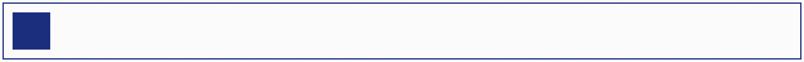
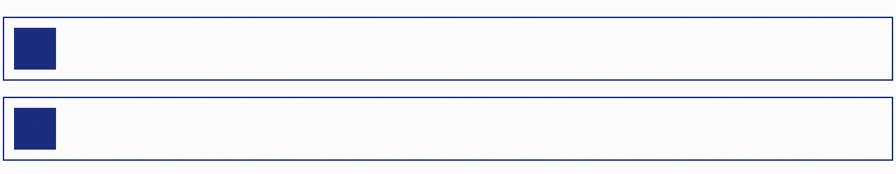
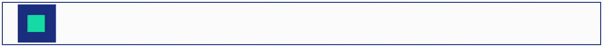
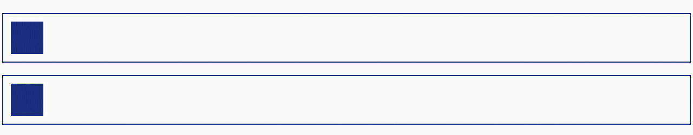
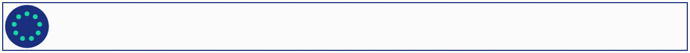
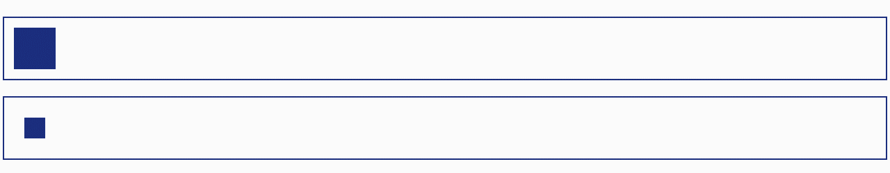
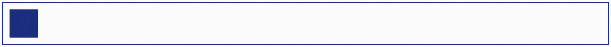
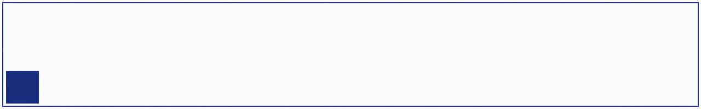
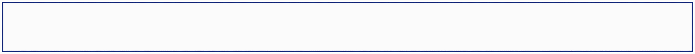

# Animations

Pour créer une transition, vous aurez besoin de plusieurs informations :

- une **propriété CSS** à modifier ;
- une **valeur initiale** pour votre propriété CSS ;
- une **valeur finale** pour cette même propriété ;
- une **durée** ;
- un **événement** pour déclencher votre transition.

## Transform

`transform` et `opacity` sont les règles les plus optimisées pour des animations fluides, elles n'impactent pas le layout et permet donc au navigateur de réaliser ces opérations rapidement (contrairement à `width` par exemple).

 `transform` dipsose de pmusieurs fonctions:

* scale[X|Y]
* translate[X|Y|Z|3d]
* rotate[X|Y|Z|3d]
* skew[X|Y]
* perspective

Combiner plusieurs transforms

```css
transform:
  translateX(100px)
  rotate(45deg)
  scale(1.2);
```

**L’ordre compte** — le résultat change.

## Transition

La propriété  `transition-duration` vous permet d'indiquer la durée que prendra votre transition.

**CSS**

```css
.btn {
    background: #011c37;
    color: #15DEA5;
    font-size: 3rem;
    cursor: pointer;
    padding: 1.85rem 3rem;
    border-radius: 10rem;
    transform: scale(1);
    transition-property: transform;
    transition-duration: 400ms;
}

.btn:hover {
    transform: scale(1.15);
}
```

**HTML**

```html
<div style="display:inline-block;border: 3px solid red;">
	<button class="btn">HELLO</button>
</div>
```

**Exemple de validation de champ (SASS)**

Lors de la perte de focus et si le champ est invalide on change la couleur de fond.

```css
$cd-txt: #6300a0;
$cd-box: #fff;
$cd-txt--invalid: #fff;
$cd-danger: #b20a37;
.form {
    &__group {
        & input {
            border: 2px solid $cd-box;
            border-radius: 100rem;
            color: $cd-txt;
            font-family: 'Montserrat', sans-serif;
            font-size: 2.5rem;
            outline: none;
            padding: .5rem 1.5rem;
            width: 100%;
            &:focus {
                border: 2px solid $cd-txt;
            }
            &:not(:focus):invalid {
                background: $cd-danger;
                border: 2px solid $cd-danger;
                color: $cd-txt--invalid;
            }
        }
    }
}
```

**Exemple avec un selecteur adjacent**

Ici nous agissons sur l'élément adjacent mais c'est le bouton qui déclenche l'animation.

**HTML**

```html
<body>
    <div class="container">
        <div class="btn">
            C'est partiii!
        </div>  
        <div class="ball"></div>
    </div>
</body>
```

**CSS**

```css
.btn {
    background: $cd-primary;
    font-size: 3rem;
    cursor: pointer;
    padding: 1.85rem 3rem;
    border-radius: 10rem;
    &:hover + .ball{
        transform: scale(1.15);
    }
}
.ball {
    width: $ball-size;
    height: $ball-size;
    background: $cd-secondary;
    margin-bottom: 1rem;
    border-radius: $ball-size * 0.5;
}
```

### Combiner les transitions

Certains effets nécessitent d’animer plusieurs propriétés. Impossible de passer à côté ! Mais pas de souci à se faire : au sein d’une transition, vous  pouvez facilement animer **deux propriétés**, ou même trois, ou même autant que vous souhaitez.

**HTML**

```html
<body>
    <div class="container">
        <div class="btn">
            Survole-moi!
        </div>
    </div>
</body>
```

**CSS**

Le mot clé  `all` nous permet d’indiquer au navigateur d’appliquer la transition à toutes les propriétés que nous avons modifiées au sein de l'animation (ici `transform` et `background-color`)

```css
.btn {
    background-color: rgba(1, 28, 55, 0);
    border: 4px solid rgba(1, 28, 55, 1);
    border-radius: 10rem;
    cursor: pointer;
    font-size: 3rem;
    overflow: hidden;
    padding: 1.85rem 3rem;
    position: relative;
    transition: all 450ms;
    &:hover {
        transform: scale(1.13);
        background-color: rgba(1, 28, 55, 1);
    }
}
```

## KeysFrames

Voici un **résumé clair et compact des `@keyframes` en CSS** 👇

------

### Principe

`@keyframes` permet de définir une **animation CSS complète** avec plusieurs étapes dans le temps.

Contrairement à `transition` :

- `transition` = A → B
- `@keyframes` = A → B → C → D → … (timeline complète)

------

### Structure

```css
@keyframes nomAnimation {
  0%   { propriété: valeur; }
  50%  { propriété: valeur; }
  100% { propriété: valeur; }
}
```

Puis on l’applique :

```css
.element {
  animation: nomAnimation 2s;
}
```

------

### Étapes possibles

Tu peux utiliser :

```
0% → début
100% → fin
```

ou mots-clés :

```css
from { ... }   /* = 0% */
to   { ... }   /* = 100% */
```

------

### Exemple simple

```css
@keyframes slide {
  from { transform: translateX(0); }
  to   { transform: translateX(200px); }
}

.box {
  animation: slide 1s linear;
}
```

------

### Propriétés d’animation associées

**Raccourci**

```css
animation: name duration timing-function delay iteration direction fill-mode;
```

------

**Détail**

```css
animation-name
animation-duration
animation-timing-function
animation-delay
animation-iteration-count
animation-direction
animation-fill-mode
animation-play-state
```

------

**Répétition**

```css
animation-iteration-count: infinite;
animation-iteration-count: 3;
```

------

**Direction**

```css
animation-direction: normal;
animation-direction: reverse;
animation-direction: alternate;
animation-direction: alternate-reverse;
```

------

**État final conservé**

```css
animation-fill-mode: forwards;
```

Sinon l’élément revient à l’état initial.

Options :

```
none
forwards
backwards
both
```

------

### Pause / reprise

```
animation-play-state: paused;
animation-play-state: running;
```

------

### Bonnes pratiques performance

Animer de préférence :

✅ `transform`
✅ `opacity`

Éviter :

❌ `top/left`
❌ `width/height`
❌ layout properties

## Outil Chrome

L'outil chrome permet de visualiser en temps réel les animations


## 12 principes de l’animation

On ajoute des animations à un site web dans le but d’offrir une expérience plus **immersive** et **engageante** aux utilisateurs, dont les cerveaux sont programmés pour accepter les  imperfections de la nature. Pour créer une expérience satisfaisante,  nous devons donc insuffler de la vie dans nos animations.

**Squash and Stretch (compression et étirement)**

e principe permet de donner de la **masse** à un objet, en l’étirant quand il accélère, puis en l’aplatissant et en l'élargissant quand il ralentit. Imaginez une balle en caoutchouc qui  rebondit sur le sol en **s'aplatissant** avant de rebondir.

[](https://user.oc-static.com/upload/2021/02/09/16128892736152_Gif023.gif)Squash and Stretch

Vous pouvez voir ici **l’étirement** **horizontal** pendant l’accélération, puis la compression au moment de la décélération à l’arrivée contre le mur.

**Anticipation**

Le principe de **l’anticipation** permet de **préparer l'audience** (ici, l'utilisateur) à une action à venir, lui donnant ainsi plus  d'impact. Un chat qui se trémousse avant de bondir, le bras d'Astérix  qui tourne avant de décocher un coup à un Romain… Les personnages animés ont besoin de mouvements préliminaires pour donner de la force à leurs  actions. À l'inverse, un mouvement sans anticipation paraîtra lisse et  artificiel.

[](https://user.oc-static.com/upload/2021/02/09/16128892932711_Gif024.gif)Anticipation

**Staging (mise en scène)**

La **mise en scène**, dans le contexte de l’animation, désigne la **composition**. Il s’agit de **guider** les yeux des utilisateurs, vers les parties importantes de l’écran par  l’utilisation de mouvements. Par exemple, cela peut se réaliser en  faisant ressortir le bouton sur lequel nous voulons que l’utilisateur  clique.

[](https://user.oc-static.com/upload/2021/02/18/16136584219165_Gif025 (1).gif)Staging


**Straight Ahead and Pose to Pose (toute l'action d'un coup et partie par partie)** 

Straight Ahead et Pose to Pose sont deux différentes techniques qui permettent  de créer des animations traditionnelles qui ne s’appliquent pas  vraiment à l’animation web. Cependant, en CSS, il existe aussi deux  différentes méthodes d’animation : les **transitions**, dont nous avons commencé à parler, et les **keyframes**, que nous étudierons bientôt. Les transitions sont basées sur une valeur de début et une valeur de fin, entre lesquelles le navigateur crée  l’animation. Avec les keyframes, nous apprendrons à créer des animations par étapes, ou comme ci-dessous, partie par partie.

[

**Follow Through and Overlapping Action (continuité du mouvement initial et chevauchement de deux mouvements consécutifs)**

Dans le monde réel, la **masse** et la **densité** des objets ne sont pas uniformes, ils accélèrent et décélèrent donc à  des vitesses différentes. Imaginez que vous êtes dans une voiture et que votre tête est plaquée à l’appuie-tête lors de l’accélération, ou  qu’elle est balancée vers l’avant quand le conducteur pile. Sans follow  through ou overlapping action, vous resteriez statique dans la voiture  lors des changements de vitesse. Le fait de donner des vitesses  différentes au différentes parties d’un objet ajoute de l’authenticité à nos animations, et contribue à lui donner une masse réaliste.

[](https://user.oc-static.com/upload/2021/02/09/16128893355601_Gif027.gif)Follow Through et Overlapping Action

**Slow in and slow out (ralentissement en début et en fin de mouvement)**

Aussi connu comme "ease-in" et "ease-out" (que vous verrez dans ce cours) ce  principe est basé sur le fait que les objets ne démarrent pas et ne  s’arrêtent pas instantanément. Ils **accélèrent** et **décélèrent**. *Slow in* fait référence à l’accélération d’un objet, et *slow out* à la décélération. En appliquant des valeurs différentes à nos  accélérations et décélérations, on peut modifier la perception de la  taille ou de la masse d’un objet, rendre les mouvements plus vifs, ou  plus laborieux pour un objet lourd.

[](https://user.oc-static.com/upload/2021/02/09/16128893470259_Gif028.gif)Slow in et slow out

**Arc**

La nature ne crée pas de lignes droites, et les mouvements naturels ne  font pas exception à la règle. Cet exemple est un peu plus compliqué à  exprimer avec une boîte en animation CSS, mais l’introduction d’arcs  dans le mouvement d’un objet peut aider à le rendre plus **naturel**, comme ici.

[](https://user.oc-static.com/upload/2021/02/09/16128893593509_Gif029.gif)Un arc

**Secondary Action (action secondaire)**

Ajouter des animations pour séparer différentes parties d’une scène peut aider à **accentuer** ou **renforcer** les principaux éléments d’une animation.

[](https://user.oc-static.com/upload/2021/02/09/16128893696087_Gif030.gif)Une animation d'action secondaire

**Timing**

Les objets doivent se déplacer à des **vitesses crédibles** par rapport à leur taille et à leur masse. Un semi-remorque accélère et décélère plus lentement et de manière plus homogène qu’une Ferrari, qui peut accélérer en un clin d’œil et s’arrêter quasiment sur place. On  contrôle le timing des objets par rapport à leurs tailles relatives,  ainsi que par la durée de l’animation.

[](https://user.oc-static.com/upload/2021/02/09/16128893834654_Gif031.gif)Le principe de timing

**Exaggeration (exagération)**

Même si le but est bien de rendre les animations réalistes, trop pousser ce  réalisme peut résulter en un mouvement austère et fade. Aller un peu  au-delà des limites naturelles permet de donner un peu de **caractère** et de personnalité à une animation.

[](https://user.oc-static.com/upload/2021/02/09/1612889396684_Gif032.gif)Exaggeration

**Solid Drawing (notion de volume)**

Traditionnellement, ce principe fait référence à la façon de réaliser une scène en  représentant correctement la perspective. Pour nous, ce principe  concerne la **structure du code** de l’animation. Il est  très important de comprendre les tenants et les aboutissants des  propriétés qu’on utilise, pour s’assurer que les animations  correspondent au résultat souhaité. Si on ne construit pas le code avec  les animations à l’esprit, on peut facilement se retrouver avec, au lieu de quelque chose comme ça :

[](https://user.oc-static.com/upload/2021/02/09/16128894147984_Gif033.gif)Une animation avec Solid Drawing

Une animation qui ressemblerait plutôt à ça :

[](https://user.oc-static.com/upload/2021/02/09/16128894248934_Gif034.gif)Une animation sans Solid Drawing

**Appeal (charisme)**

Pour rendre nos animations plus **dynamiques** et plus intéressantes, on peut y ajouter quelques effets supplémentaires.  Le centre de l’attention l’est parce qu’il attire tous les regards.  C’est l’attrait et le charisme qui attirent l’attention, et la  conservent.

[](https://user.oc-static.com/upload/2021/02/09/16128894369541_Gif035.gif)