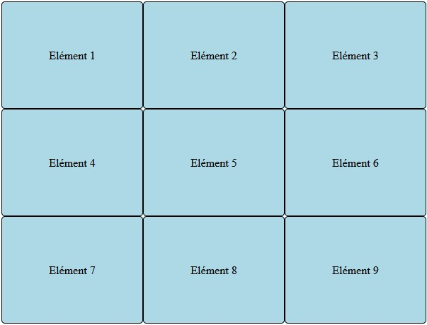
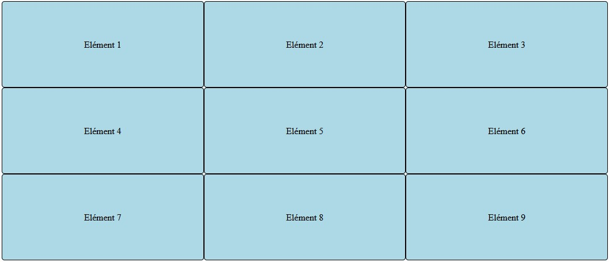
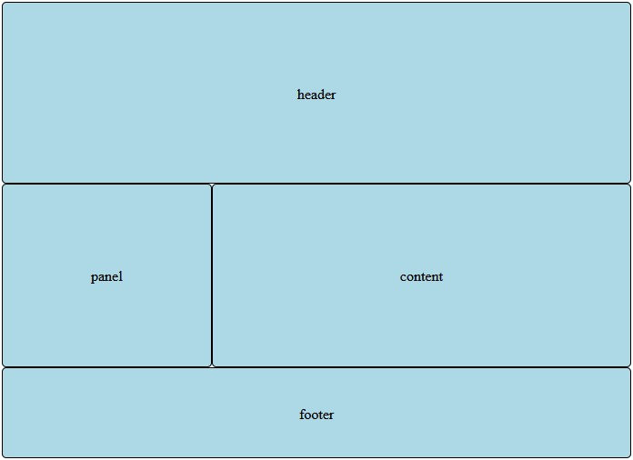
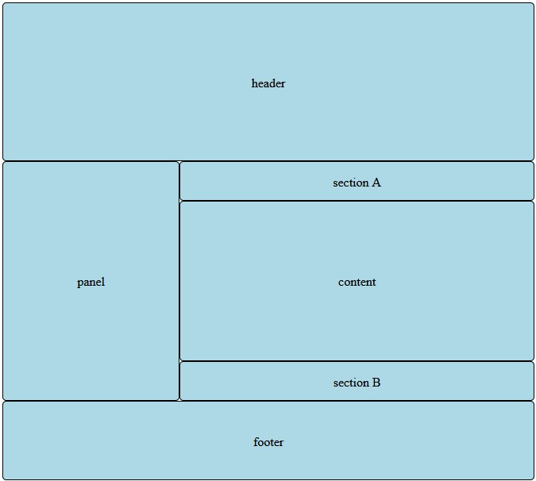

# Placement en grille avec CSS 3

Savez vous que vous n'avez nullement besoin d'un Framework pour créer votre Layout avec un système de grille flexible ?

## Résumé
## Grille simple



Ici on applique un style simple de grille fixe. Chaque colonne vaut 200 pixels et il y a 3 colonnes. Le reste des éléments est réparti en grille.

```css
.container {
  display: grid;
  grid-template-columns: 200px 200px 200px;
}
.element {
  line-height: 150px;
  height: 150px;
  border-radius: 5px;
  background-color: lightblue;
  text-align: center;
  border: 1px solid #000;
}
```

Les éléments HTML sont simplement ajouté les un derrière les autres.

```html
<div class="container">
    <div class="element">Elément 1</div>
    <div class="element">Elément 2</div>
    <div class="element">Elément 3</div>
    <div class="element">Elément 4</div>
    <div class="element">Elément 5</div>
    <div class="element">Elément 6</div>
    <div class="element">Elément 7</div>
    <div class="element">Elément 8</div>
    <div class="element">Elément 9</div>
</div>
```
Et plus simplement vous pouvez utiliser le fractionnement comme diviseur de la grille.


```css
.container {
  display: grid;
  grid-template-columns: 1fr 1fr 1fr;
}
```

## Grille placement

Allons un peu plus loin en spécifiant exactement les cases qui seront utilisés pour chacun des éléments.



Vous pouvez utiliser les propriétés `grid-column-start` et `grid-column-end` ainsi que `grid-row-start` et `grid-row-end` pour définir l'emplacement de vos éléments.

> NOTEZ: Les indexes détermine toujours l'élément suivant comme fin, exemple: pour 3 colonnes, `grid-column-end` vaudra `4`; (le début de la 4eme colonne ou la fin de la 3eme colonne).


```css
.container {
    display: grid;
    grid-template-rows: 200px auto 100px;
    grid-template-columns: 1fr 1fr 1fr;
}

.box {
    border-radius: 5px;
    background-color: lightblue;
    text-align: center;
    border: 1px solid #000;
}

.header {
    line-height: 200px;
    grid-column-start: 1;
    grid-column-end: 4;
}

.panel {
    line-height: 200px;
    grid-column-start: 1;
    grid-column-end: 2;
}

.content {
    line-height: 200px;
    grid-column-start: 2;
    grid-column-end: 4;
}

.footer {
    line-height: 100px;
    grid-column-start: 1;
    grid-column-end: 4;
}
```

```html
<div class="container">
    <div class="header box">header</div>
    <div class="panel box">panel</div>
    <div class="content box">content</div>
    <div class="footer box">footer</div>
</div>
```

De la même façon, nous pouvons spécifier les lignes.




```css

        .container {
            display: grid;
            grid-template-rows: 200px 50px auto 50px 100px;
            grid-template-columns: 1fr 1fr 1fr;
        }

        .box {
            border-radius: 5px;
            background-color: lightblue;
            text-align: center;
            border: 1px solid #000;
        }

        .header {
            line-height: 200px;
            grid-column-start: 1;
            grid-column-end: 4;
            grid-row-start: 1;
            grid-row-end: 1;
        }

        .panel {
            line-height: 300px;
            grid-column-start: 1;
            grid-column-end: 2;
            grid-row-start: 2;
            grid-row-end: 5;
        }

        .sectionA {
            line-height: 50px;
            grid-column-start: 2;
            grid-column-end: 4;
            grid-row-start: 2;
            grid-row-end: 3;
        }

        .sectionB {
            line-height: 50px;
            grid-column-start: 2;
            grid-column-end: 4;
            grid-row-start: 4;
            grid-row-end: 5;
        }

        .content {
            line-height: 200px;
            grid-column-start: 2;
            grid-column-end: 4;
            grid-row-start: 3;
            grid-row-end: 3;
        }

        .footer {
            line-height: 100px;
            grid-column-start: 1;
            grid-column-end: 4;
            grid-row-start: 5;
            grid-row-end: 5;
        }
```

```html
<div class="container">
    <div class="header box">header</div>
    <div class="panel box">panel</div>
    <div class="sectionA box">section A</div>
    <div class="content box">content</div>
    <div class="sectionB box">section B</div>
    <div class="footer box">footer</div>
</div>
```

--------------------------

Auteur: [Thomas AUGUEY](https://github.com/Ace4teaM)
