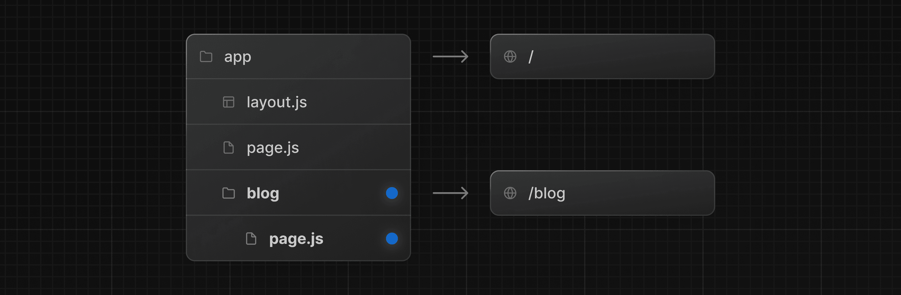

# React

React est un projet open-source, distribué sous la licence MIT

**React = moteur de logique UI**
**React Web = rendu web**
**React Native = rendu mobile**

Ici nous présentons du React Web

Avec React vous construisiez votre application à partir de **composants**.

> Un composant = HTML + CSS + JS.

React se présente comme "une bibliothèque JavaScript pour créer des interfaces utilisateurs"

## Documentation

**https://react.dev/**

## Principe

React lui-même ne manipule pas directement le DOM du navigateur. À la place, React génère un **DOM virtuel**, distinct du DOM des navigateurs. Au moment venu, il **réconcilie** ce DOM virtuel avec le DOM du navigateur, en prenant soin de minimiser le nombre d'opérations nécessaires.

**`main.jsx` est le point d'entrée de votre application :**

**createRoot** permet de s'attacher à notre HTML.

Ci-dessous, l’id  `root`permet de préciser où notre app React va vivre dans le HTML de notre projet. 

**render** va ordonner à ReactDOM de générer (*rendre*) notre composant React qui s’appelle App :

```jsx
import { createRoot } from 'react-dom/client'
import App from './App.jsx'

createRoot(document.getElementById('root')).render(<App />)
```

**`App.jsx` est votre composant principal**

```jsx
function App() {
  return <div>Bienvenue dans le cours Débutez avec React</div>;
}
export default App;
```

**Racines multiples**

React est prévus pour s'intégrer dans une page HTML existante. Mais certaines partie de votre page n'a pas toujours besoin d'être géré dynamiquement. Ca peut être le cas de d'une **Intégration progressive** (ajouter React sans réécrire toute la page) , **Micro-frontends** (Chaque équipe / module monte son propre root), **Pages hybrides** (HTML/CSS existant, React seulement là où c’est nécessaire).

HTML

```html
<div id="header-root"></div>
<div id="content-root"></div>
<div id="footer-root"></div>
```

React

```jsx
import { createRoot } from 'react-dom/client'

createRoot(document.getElementById('header-root'))
  .render(<Header />)

createRoot(document.getElementById('content-root'))
  .render(<App />)

createRoot(document.getElementById('footer-root'))
  .render(<Footer />)
```

✔️ Chaque zone est contrôlée par React
✔️ Le reste du HTML reste intact

Chaque root a :

- son propre Context
- son propre cycle de vie
- son propre scheduler

Comment partager des données entre roots ?

Via l’extérieur de React :

- `localStorage`
- `sessionStorage`
- `window` (events / variables)
- EventBus custom
- State manager global (Redux, Zustand…)

## VITE

Vite est un paquetage Node.JS qui permet de déployer un serveur local avec fonctionnalité de rechargement à chaud. Très pratique pour déployer le projet.

Créer un projet:

```shell
npm create vite@latest simple
```

Créer à partir d'un template

```shell
npm create vite@latest simple -- --template react
```

**Assets**

Avec Vite, l'import d'images est simple et optimisé automatiquement !  Vite traite vos assets (images, fonts, etc.) et les optimise pour la  production.

**Modules CSS**

Pour les plus curieux, Vite supporte nativement les **CSS Modules** ! C'est une approche qui évite les conflits de classes CSS.

Il suffit de nommer votre fichier avec le suffixe  `.module.css`. (exemple :  `Banner.module.css`)

```css
/* Banner.module.css */
.banner {
  background-color: #f8f9fa;
  padding: 32px;
}

.title {
  color: #31b572;
  font-size: 2rem;
}
```

Vous pourrez ensuite utiliser les différentes classes comme des  propriétés d’un objet javascript que nous appellerons ici styles et que  nous importerons dans notre fichier  `Banner.jsx` :

```jsx
import styles from '../styles/Banner.module.css'

const Banner = () => {
  return (
    <div className={styles.banner}>
      <h1 className={styles.title}>La maison jungle</h1>
    </div>
  )
}
```

**Commandes essentielles**

Votre projet Vite dispose de plusieurs commandes utiles :

#### Développement

La commande suivante démarre le serveur de développement :

```
npm run dev
```

Vos modifications sont visibles instantanément.

#### Construction pour la production

La commande suivante crée une version optimisée de votre  `App` dans le dossier  `dist` , prête à être déployée :

```
npm run build
```

#### **Prévisualisation**

La commande suivante permet de tester la version de production en local avant de la déployer :

```
npm run preview
```

## .JSX

JSX permet de décrire l’UI avec une syntaxe proche du HTML, tout en gardant toute la puissance de JavaScript.

**Sans JSX (JavaScript pur)**

```jsx
React.createElement(
  "h1",
  null,
  "Bonjour"
)
```

**Avec JSX (beaucoup plus lisible)**

```jsx
<h1>Bonjour</h1>
```

**Comment ça marche ?**

JSX n’est pas compris par le navigateur.

Il est **transformé** (par Vite + Babel ou esbuild) en JavaScript standard :

```jsx
<h1>Hello</h1>
```

devient :

```jsx
React.createElement("h1", null, "Hello")
```

JSX est interprété par `Babel / esbuild`

JSX est surtout connu pour React, mais peut aussi être utilisé avec :

- Preact
- SolidJS
- Vue (JSX optionnel)

**Quelques règles**

* Une seule racine
* Balises toujours fermées
* Attributs en camelCase

**Expressions JavaScript dans JSX**

Dès qu'il s'agit d'**expressions JavaScript**, elles sont écrites entre accolades.

```jsx
const name = "Thomas";
<h1>Bonjour {name}</h1>
{isLoggedIn && <User />}
{items.map(i => <li key={i.id}>{i.name}</li>)}
```

## Composant

Exemple de composant React simple

```javascript
function App() {
  return <h1>Hello React</h1>
}

export default App
```

> **Règle importante :** Il est essentiel de **mettre une majuscule à nos composants JSX**, sinon React ne saura pas qu'il s'agit d'un composant, et pensera qu'il s'agit juste d'une balise HTML.

> **Astuce :** React met également à notre disposition un outil, les **Fragments**, si on veut wrapper deux composants dans un seul parent sans que le parent apparaisse dans le DOM. Pour ça, vous pouvez utiliser  `< >` et  `</>`:

```jsx
<>
  <Header />
  <Description />
</>
```

### **Manipulez des données dans vos composants JSX**

> Affichez des variables

```jsx
// pour une string
const title = "La maison jungle"
<div>{title}</div>

// pour un nombre
const price = 15
<div>{price}€</div>
```

> Faites des calculs

```jsx
<div>Total : {8 + 10 + 15}€</div>
```

> Transformer des données

```jsx
const shopName = "la maison jungle"
<h1>{shopName.toUpperCase()}</h1>
```

> Utiliser des conditions

```jsx
const isOpen = true
<div>{isOpen ? 'Boutique ouverte' : 'Boutique fermée'}</div>
```

### **Classes**

En React, impossible d'utiliser l'attribut  `class` comme en HTML classique parce que  `class` est un mot réservé en JavaScript !

**`className`**. C'est l'équivalent React de class en HTML

```jsx
<div className="classe-principale classe-secondaire">Contenu</div>
```

### **Style**

Il est possible d'utiliser les styles CSS, mais contrairement au HTML, il faut lui passer un objet JavaScript :

```jsx
// React
<div style={{ color: 'red', fontSize: '16px' }}>Texte</div>
```

> Notez que les propriétés CSS passent en camelCase (font-size → fontSize).

### **JavaScript map() + JSX**

En React,  `map()` va nous permettre de **transformer une liste de données en liste de composants JSX**. 

```jsx
const plantList = [
  'monstera',
  'ficus lyrata', 
  'pothos argenté',
  'yucca',
  'palmier'
]

const ShoppingList = () => {
  return (
    <ul>
      {plantList.map((plant, index) => (
        <li key={`${plant}-${index}`}>{plant}</li>
      ))}
    </ul>
  )
}

export default ShoppingList
```

> La méthode  `map()` permet d'itérer sur des données et de retourner un tableau d'éléments. Par ailleurs, les méthodes  `forEach()`,  `filter()`,  `reduce()`, etc., qui permettent de manipuler des tableaux, seront également vos alliés en React.

### **Propriété `key`**

Vous avez peut-être remarqué l'attribut  `key` dans notre exemple. Cette prop est **indispensable** quand vous créez des listes en React !

> Si vous oubliez la prop  `key`,  React affichera un avertissement dans la console. Cette prop aide React à identifier quels éléments ont changé, ont été ajoutés ou supprimés.

1. **Elle doit être unique** au sein du tableau
2. **Elle doit être stable** dans le temps (même donnée = même  `key` )

### **Propriétés (props)**

Imaginons un composant `CareScale` utilisable ainsi:

```jsx
<carescale scalevalue=3></carescale>
```

Nous lui avons définit une propriété `scalevalue` que nous pouvons récupéré dans le code du composant:

```jsx
function CareScale(props){
  const scaleValue = props.scaleValue
  return <div>{scaleValue}☀️</div>
}
```

ou

```jsx
const CareScale = (props) => {
  const scaleValue = props.scaleValue
  return <div>{scaleValue}☀️</div>
}
```

ou

```jsx
const CareScale = ({ scaleValue }) => {
  return <div>{scaleValue}☀️</div>
}
```

> Dans la méthode moderne, j'utilise des accolades { } directement dans  les paramètres. C'est comme si je disais : "Dans l'objet props que je  reçois, récupère-moi directement la propriété scaleValue". Cette syntaxe s'appelle la **déstructuration** et elle nous évite d'écrire props.scaleValue à chaque fois !Ici 

Ici nous récupérons 2 propriétés (`scaleValue` et `careType`):

```jsx
const CareScale = ({ scaleValue, careType }) => {
    const range = [1, 2, 3]
    const scaleType = careType === 'light' ? '☀️' : '💧'

    return (
        <div>
            {range.map((rangeElem) =>
            scaleValue >= rangeElem ? (
                <span key="{rangeElem.toString()}">{scaleType}</span>
                ) : null
            )}
        </div>
    )
}

export default CareScale
```

Pour les props, vous devez garder deux règles à l'esprit :

1. Une prop est toujours **passée par un composant parent à son enfant** : c'est le seul moyen normal de transmission.
2. Une prop est considérée **en lecture seule** dans le composant qui la reçoit.

### **Propriété children (props)**

`children` est une propriété spéciale qui pointe sur les enfants du composant.

Par exemple si un contenu est définit dans la syntaxe parent :

```jsx
<Banner>
  
  <h1 className='lmj-title'>La maison jungle</h1>
</Banner>
```

vous pouvez les restituer comme un container dans votre code de composant:

```jsx
const Banner = ({ children }) => {
    return <div classname="lmj-banner">{children}</div>
}
```

> Cette manière d'utiliser  `children` est particulièrement utile lorsqu'un composant ne connaît pas ses enfants à l'avance, par exemple pour une barre de navigation`Sidebar` ou bien pour une modale.

**Importer des éléments dynamiquement**

```jsx
import CareScale from "./CareScale"
import '../styles/PlantItem.css'

// importe la liste des fichiers
const images = import.meta.glob(
    "../assets/*.jpg",
    { eager: true, import: "default" }
);

console.log(images);

// transforme en dictionnaire { "nom fichier" : "url", ...}
const icons = Object.fromEntries(
    Object.entries(images).map(([path, url]) => {
        const name = path.split("/").pop().replace(".jpg", "");
        return [name, url];
    })
);

console.log(icons);

const MyComponent = ({image_name}) => {
	return	</img>;
}

export default PlantItem;
```

### **Evénements**

Déclarer la méthode de retour (JavaScript standard)

```jsx
const handleClick = () => {
  console.log('✨ Ceci est un clic ✨')
}
```

Vous pouvez également utiliser une fonction classique mais sont comportement varie et notamment l'utilisation de this.

* le `this` **dynamique** (fonctions classiques) dépend de la façon dont la fonction est appelée pas de l’endroit où elle est définie

```javascript
function sayHello() {
  console.log(this.name)
}

const user1 = { name: "Alice", sayHello }
const user2 = { name: "Bob", sayHello }

user1.sayHello() // Alice
user2.sayHello() // Bob
```

* le `this` **lexical** (fonctions fléchées) est capturé depuis le contexte parent, il **ne change jamais**.

```javascript
const user = {
  name: "Alice",
  sayHello() {
    setTimeout(() => {
      console.log(this.name)
    }, 1000)
  }
}

user.sayHello() // Alice
```

**Pourquoi c’est crucial en React ? **

Avec function

```jsx
<button onClick={function () {
  console.log(this) // Ici `this` est imprévisible ❌
}}>
```

Solution avec arrow function

```jsx
<button onClick={() => {
  console.log(this) // `this` stable et attendu ✔️
}}>
```

**Evénement avec passage d'arguments**

React passe par défaut un objet (que nous aborderons bientôt), mais ici, nous voulons lui spécifier notre propre argument.

Cette fonction appellera  `handleClick` en lui passant  `name` en paramètre.

```jsx
<li onClick={() => handleClick(name)}></li>
```

**Evénement et argument par défaut**

React passe par défaut en paramètre aux fonctions indiquées en callback des événements. Voyons voir à quoi ça ressemble. 

Si je **récupère le paramètre dans  `handleClick`** :

```jsx
const handleClick = (e) => {
  console.log('✨ Ceci est mon event :', e)
}
```

`e` est un **événement synthétique** (dérivé de `SyntheticBaseEvent`). En bref, il s'agit de la même interface que pour les événements natifs du DOM, sauf qu'ils sont  compatibles avec tous les navigateurs.

> Vu qu'il s'agit de la même interface que pour les événements natifs du DOM on a aussi accès à  `preventDefault` et  `stopPropagation` !

### **Formulaires (non contrôlé)**

Voici un form avec input :

```jsx
<form onSubmit={handleSubmit}>
  <input type='text' name='my_input' defaultValue='Tapez votre texte' />
  <button type='submit'>Entrer</button>
</form>
```

Et pour handleSubmit, cela donne :

```jsx
const handleSubmit = (e) => {
  e.preventDefault()
  alert(e.target['my_input'].value)
}
```

**Formulaires (contrôlé)**

Voici un composant de formulaire

```jsx
import { useState } from 'react'

const QuestionForm = () => {
  const [inputValue, setInputValue] = useState('Posez votre question ici')
  
  return (
    <div>
      <textarea
        value={inputValue}
        onChange={(e) => setInputValue(e.target.value)}
      />
    </div>
  )
}

export default QuestionForm
```

Ici, je passe une fonction en callback à  `onChange` pour qu'elle sauvegarde dans mon state local la valeur de mon input. J'accède à la valeur tapée dans l'input avec  `e.target.value`.

`inputValue`  a maintenant accès au contenu de mon input à tout moment. Je peux donc  créer un bouton qui déclenche une alerte qui affiche le contenu de mon  input, comme ici :

```jsx
<div>
  <textarea
    value={inputValue}
    onChange={(e) => setInputValue(e.target.value)}
  />
  <button onClick={() => alert(inputValue)}>Alertez moi 🚨</button>
</div>
```

Eh bien, cela permet d'**interagir directement avec la donnée renseignée par l'utilisateur**. Vous pouvez donc afficher un message d'erreur si la donnée n'est pas  valide, ou bien la filtrer en interceptant une mauvaise valeur.

Si nous décidons qu'il n'est pas autorisé d'utiliser la lettre "f" (bon  oui, c'est un peu bizarre), eh bien nous pouvons déclarer une variable pour afficher un message.

```jsx
{isInputError && (
  <div>🔥 Vous n'avez pas le droit d'utiliser la lettre "f" ici.</div>
)}
```

Nous pouvons intercepter une mauvaise valeur entrée  par l'utilisateur. Pour cela, il faut déclarer une fonction  intermédiaire :

```jsx
const [isInputError, setIsInputError] = useState(false)
  
const checkValue = (value) => {
  if (!value.includes('f')) {
    setInputValue(value)
    setIsInputError(false)
  }
  else
    setIsInputError(true)
}
```

et on applique la modification dans notre fonction callback :

```jsx
onChange={(e) => checkValue(e.target.value)}
```

> il existe également des bibliothèques qui vous permettent de gérer les  formulaires et leur validation aussi proprement que possible, par  exemple le très bon outil[ react-hook-form](https://react-hook-form.com/).

### **States**

> Le state local est présent à l'intérieur d'un composant et **garde sa valeur, même si l'application le re-render**. On peut alors dire qu'il est **stateful**.

Prenons cet exemple de gestion d'un panier:

```jsx
import { useState } from 'react'

const Cart = () => {
  const monsteraPrice = 8
  const [cart, updateCart] = useState(0)

  return (
    <div className='lmj-cart'>
      <h2>Panier</h2>
      <div>
        Monstera : {monsteraPrice}€
        <button onClick={() => updateCart(cart + 1)}>
          Ajouter
        </button>
      </div>
      <h3>Total : {monsteraPrice * cart}€</h3>
    </div>
  )
}

export default Cart
```

> Lorsqu'un state est modifié, alors l'affichage du composant est  rafraichit et la valeur affichée est actualisée, on dit que le composant est **re-render**.

`useState` est un **hook** qui permet d'ajouter le state local React à des composants fonctions. Un hook est **une fonction qui permet de « se brancher » (to hook up) sur des fonctionnalités React**. On peut d'ailleurs les importer directement depuis React. `useEffect` est également un hook.

`useState` nous **renvoie une paire de valeurs dans un tableau de 2 éléments**, que nous récupérons dans les variables  `cart` et  `updateCart` dans notre exemple. Le premier élément est la valeur actuelle, et le deuxième est une fonction qui permet de la modifier (setter).

```jsx
const [cart, updateCart] = useState(0)
```

Sans la syntaxe de la décomposition en Javascript (`[cart, updateCart] = ...` ), nous aurions aussi pu faire :

```jsx
const cartState = useState(0)
const cart = cartState[0]
const updateCart = cartState[1]
```

> Il est important de préciser une valeur initiale dans votre state. Sinon, elle sera *undefined* par défaut, et ce n'est pas un comportement souhaitable : plus vous serez explicite, mieux votre application s'en portera !

### **Effects**

Les effets permettent de déclencher un événement à chaque modification d'une variable spécifiée

```jsx
import { useEffect } from 'react'

const MyComponent = () => {
    const [total, setTotal] = useState(0)
    
    // appelé à chaque modification de total
    useEffect(() => {
        alert(`J'aurai ${total}€ à payer 💸`)
    }, [total])
}
```

Conditions qui déclenche un `useEffect`

1. `useEffect` l'argument `deps` n'est pas spécifié, alors il est déclenché à chaque rendu

```jsx
useEffect(() => { ... })
```

2. `useEffect` l'argument `deps` est spécifié mais vide, il se déclenche après le premier rendu du composant

```jsx
useEffect(() => { ... }, [])
```

3. `useEffect` l'argument `deps`  est spécifié avec une ou plusieurs variables, alors il est déclenché à chaque changement de valeur de l'une des variables. React compare **les valeurs à chaque rendu** pour décider si l’effet doit être réexécuté

```jsx
useEffect(() => { ... }, [var1, var2, ...])
```

Mais quelques règles particulières s'appliquent au hook useEffect :

- **Appelez toujours** **`useEffect`** **à la racine de votre composant**. Vous ne pouvez pas l'appeler à l'intérieur de boucles, de code  conditionnel ou de fonctions imbriquées. Ainsi, vous vous assurez  d'éviter des erreurs involontaires.
- **Comme pour** **`useState`****,** **`useEffect`** **est uniquement accessible dans un composant fonction React**. Donc ce n'est pas possible de l'utiliser dans un composant classe, ou dans une simple fonction JavaScript.
- **Par ailleurs, je vous conseille de séparer les différentes actions effectuées dans différents useEffect**. Cela est plutôt une bonne pratique qu'une règle.

*Principe général*

- Le tableau de dépendances `[dep1, dep2]` peut contenir **n’importe quelle expression JavaScript**
  - Props
  - State (useState, useReducer)
  - Variables constantes (`const`) déclarées **hors du composant**
  - Fonctions **mémorisées** (`useCallback`)
- MAIS pour les variables déclarées **dans le corps du composant sans useState**, React **ne peut pas suivre les changements**, donc mettre une variable “classique” dedans **n’a souvent aucun effet utile**.

*Spécificités*

Les `useEffect` s’exécutent dans l’ordre où ils sont déclarés dans le composant.

```jsx
useEffect(() => {
  console.log("Effect 1")
}, [])

useEffect(() => {
  console.log("Effect 2")
}, [])
```

Résultat

```
Effect 1
Effect 2
```

Les `useEffect` s’exécutent 2 fois si le strict mode est définit.

```jsx
import React from 'react'
import ReactDOM from 'react-dom/client'
import App from './App'

ReactDOM.createRoot(document.getElementById('root')).render(
  <React.StrictMode>
    <App />
  </React.StrictMode>
)
```

*Ce que fait StrictMode*

En **React 18**, StrictMode :

- **Monte → démonte → remonte** le composant
- Exécute donc :
  - le rendu
  - le `useEffect`
  - le cleanup (s’il existe)
  - puis **le `useEffect` à nouveau**

🎯 Objectif :

- Détecter les **effets non idempotents**
- Repérer les **side-effects dangereux**

*Tant que `StrictMode` est là :*

- `useEffect(..., [])` est exécuté **2 fois en dev**
- **1 seule fois en production**

Quand sont-ils exécutés ?

- **Après le rendu du DOM**
- **Jamais pendant le render**
- Après **chaque commit React**

**useEffect sur changement mais  PAS au premier rendu (StrictMode ou Changement de valeur)**

```jsx
import { useEffect, useRef } from 'react'

function MyComponent({ value }) {
  const isFirstRender = useRef(true)

  useEffect(() => {
    if (isFirstRender.current) {
      isFirstRender.current = false
      return
    }

    // 🔥 Exécuté seulement quand `value` change
    console.log("value a changé :", value)

  }, [value])
}
```

### **Memo**

`useMemo` est un **hook React** qui permet de **mémoriser le résultat d’un calcul** pour éviter de le refaire à chaque render.

* Il sert à **optimiser les performances**

* Il **ne crée pas d’état**

* Il **n’a aucun effet de bord**

------

**À quoi ça sert concrètement ?**

À éviter de recalculer inutilement :

- des filtres (`filter`)
- des tris (`sort`)
- des mappings coûteux
- des valeurs dérivées d’autres states / props

Exemple typique :

```
const result = useMemo(() => {
  return expensiveComputation(data);
}, [data]);
```

Le calcul n’est refait **que si `data` change**

------

**Quand utiliser `useMemo`**

Utilise `useMemo` quand :

- un calcul est **coûteux**
- le calcul dépend de **props ou state**
- le résultat est utilisé dans le rendu
- tu veux éviter des renders inutiles

Exemple parfait :

```
const selectable = useMemo(() => {
  return tags.filter(t => !selection.includes(t));
}, [tags, selection]);
```

------

**Quand NE PAS utiliser `useMemo`**

N’en abuse pas si :

- le calcul est trivial
- la lisibilité en souffre
- tu l’utilises “au cas où”

> `useMemo` est une **optimisation**, pas une obligation.

------

`useMemo` vs `useEffect`

| useMemo                      | useEffect                  |
| ---------------------------- | -------------------------- |
| Calcul pur                   | Effet de bord              |
| Pas de setState              | Souvent setState           |
| Synchrone                    | Post-render                |
| Pas de render supplémentaire | Peut en déclencher         |
| Dériver des données          | Interagir avec l’extérieur |

**Derived data → `useMemo`**
**Side effects → `useEffect`**

------

**Règle d’or**

> **Si une valeur peut être calculée à partir de props ou de state → `useMemo` (ou calcul direct)**

**Résumé**

- `useMemo` mémorise un calcul
- évite des recalculs inutiles
- remplace souvent un `useEffect + setState`
- améliore perfs **et** lisibilité quand bien utilisé

Si tu veux, je peux te faire une **fiche ultra-courte à coller dans ton README** ou un **anti-pattern / pattern comparatif** 😉

## Next.js

**À quoi sert Next.js ?**

Next.js simplifie et améliore le développement React en ajoutant **tout ce qui manque à React seul** :

- routage
- rendu côté serveur
- génération de pages statiques
- SEO
- backend léger (API)
- performances optimisées automatiquement

**Pages **

Next.js utilise **le routage basé sur le système de fichiers**

Pour créer une route il faut ajouter un fichier `page.jsx` dans le dossier `app`


 ou dans un sous dossier de `app`



*page.jsx*

```jsx
export default function Page() {
  return <h1>Hello Next.js!</h1>
}
```

**Layout**

Un Layout est une interface utilisateur qui est **partagée** entre plusieurs pages. Sur la navigation, les mises en page préservent l'état, restent interactives et ne se rendent pas.

Pour créer un Layout il faut ajouter un fichier Layout.jsx à coté de votre page.jsx


Le composant doit accepter un `children` *Prop* qui peut être une page ou un autre Layout.

layout.jsx

```jsx
export default function DashboardLayout({ children }) {
  return (
    <html lang="en">
      <body>
        {/* Layout UI */}
        {/* Place children where you want to render a page or nested layout */}
        <main>{children}</main>
      </body>
    </html>
  )
}
```

