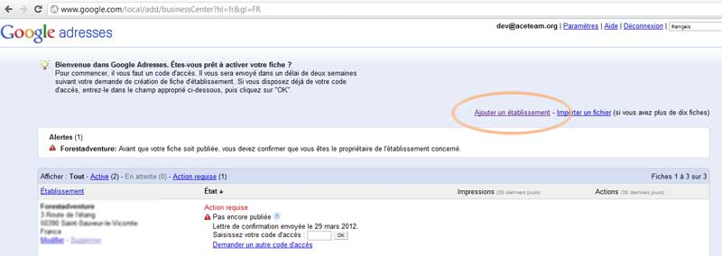

# Référencement

Comment bien référencer un site ?

## Résumé
Les principaux points d'un bon référencement

* Demander le référencement sur les moteurs seulement une fois le site entièrement terminé. En effet un référencement précoce risque de ne pas prendre en compte les modifications apportés ultérieurement avant plusieurs mois.
* Collecte de mots clés.
* Description des pages (balise meta).

## Les balises HTML

Quelques balises **meta** sont très importante pour identifier le contenu des pages.

	name             value
	description      Un description du contenu de la page, elle apparaitra généralement sous le titre dans les moteurs de recherches.
	keywords         Une liste de mots clés séparer par des virgules en rapport avec la page (une vingtaine conseillé, évité la duplication éxacte de la valeur entre les pages).

## Les liens

Référencer un site passe surtout par les liens externes, l'ajout sur les moteurs de recherches, les annuaires et les liens échangés est essentiel pour réussir.

### Les moteurs

* [Google](https://www.google.com/accounts/) Sur votre compte google
* [Bing](http://www.bing.com/toolbox/webmasters/)   Espace Webmaster
* [Yahoo!](http://siteexplorer.search.yahoo.com/submit) Site-Explorer (Utiliser **Submit Site Feed** pour ajouter un sitemap)
* [Orange](http://www.orange.fr/bin/frame.cgi?u=http://referencement.ke.orange.fr) Référencement gratuit

Autres moteurs
	
* [Kagibi](http://www.kagibi.net/inscription.php)
* [Souany bots](http://bots.souany.com/ajout.php)
* [Cite Search](http://www.citesearch.com/ajouter_un_site.php)
* [French Spider](http://www.spider-fr.com/inscription.php?action=soumettre)
* [Exalead](http://www.exalead.com/search/web/submit/)
* [Denicher.com](http://www.denicher.com/)
* [Cristalys](http://www.cristalys.com/ajout.php3)

### Annuaires

* [Open Directory Project](http://www.dmoz.org/World/Fran%C3%A7ais/) Choisissez une catégorie dans l'annuaire, puis cliquez sur proposer un siter lorsque celui-ci est disponnible en haut de page.
* [Europages](http://www.europages.fr) Spécialiste du référencement des entreprises en europe .

Annuaires (sans liens de retour)

* [Annuaire-Web](http://www.annuaire-web.info/submit.php)	Annuaire
* [Annuaire-Web-France](http://www.annuaire-web-france.com/proposer_site.php)	Annuaire
* [Itraque](http://pros.itraque.fr/)	Annuaire professionnel
* [Webmaster-Rank](http://fr.webmaster-rank.info/?ajoutez_votre_site)	Annuaire
* [QYPE](http://www.qype.fr/)	Annuaire professionnel
* [le-site-de](http://www.le-site-de.com/index.php?page=pro_ajout)	Annuaire professionnel
* [france-webmaster](http://www.france-webmaster.com/)	Annuaire de site français

Annuaires (avec liens de retour)

* [Annuaire de Sociétés](http://www.societesdeservice.com/node/add/societe)	Annuaire professionnel
* [tagbox](http://www.tagbox.fr/)	Annuaire généraliste

Annuaire web (inscription par mail)

* [118000](http://www.118000.fr/contact.html)	Annuaire

### Outils

Google Adresses

Augmenter la visibilité d'une entreprise graçe à **Google-Adresses**.

Rendez vous sur: [Google](http://www.google.com/local/) (vous devez être connecté à votre compte Google-Webmaster)

Cliquez sur **Ajouter un établissement** et suivez les instructions présentes à l'écran.

--------------------------

Auteur: [Thomas AUGUEY](https://github.com/Ace4teaM)
